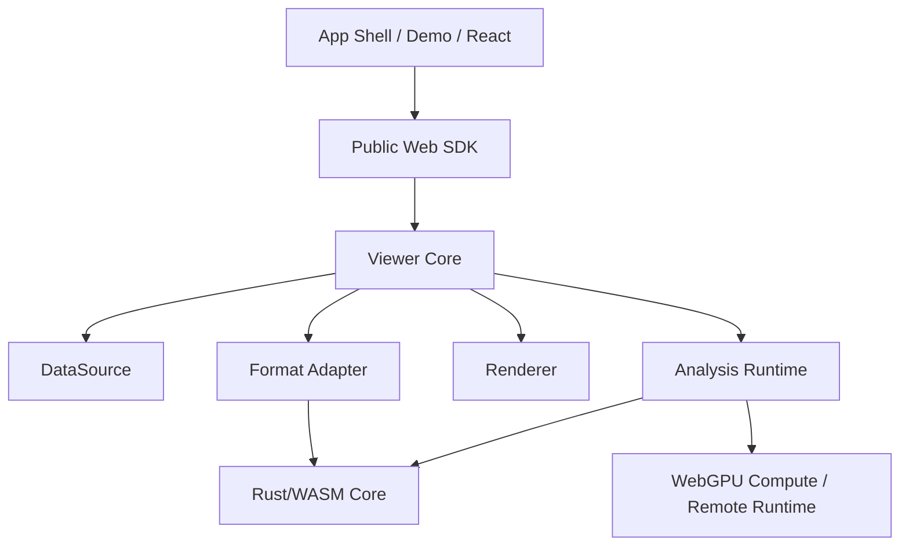
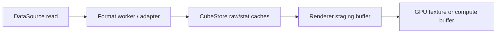

# CubeScope Architecture

## Overview

CubeScope should be built as a layered system:



The key architectural idea is separation of concerns:

1. Parsing is not rendering
2. Rendering is not analysis
3. Demo UI is not the public API

## Stable Abstractions

### 1. DataSource

The `DataSource` abstraction is responsible for byte access.

Supported implementations should eventually include:

- local `File` / `Blob`
- HTTP range requests
- object storage wrappers
- in-memory test fixtures

Suggested interface:

```ts
interface DataSource {
  id: string
  read(range: { start: number; end: number }): Promise<ArrayBuffer>
  size(): Promise<number>
  close?(): Promise<void>
}
```

### 2. FormatAdapter

`FormatAdapter` maps raw bytes into a cube-oriented model.

Responsibilities:

1. Parse metadata
2. Understand layout rules
3. Provide band/tile/spectrum extraction services
4. Describe format capabilities

Suggested first-party adapters:

- `formats-envi`
- later: `formats-geotiff`, `formats-netcdf`, `formats-zarr`

### 3. CubeStore

`CubeStore` is the core read model used by the viewer and analysis layer.

Responsibilities:

1. Expose normalized metadata
2. Serve tile reads
3. Serve spectrum reads
4. Manage statistics cache
5. Hide format-specific details from upper layers

### 4. Renderer

The renderer draws already-prepared raster layers.

Responsibilities:

1. Texture upload
2. Tile placement
3. Colormap and stretch application
4. Layer composition
5. View transform application

Renderer variants:

- `renderer-webgpu`
- `renderer-webgl`

The core system should choose WebGPU first and fall back gracefully.

### 5. Tool System

Tools control user interaction, not dataset structure.

Initial tools:

- pan
- zoom
- pixel probe
- ROI box
- ROI polygon
- layer visibility

### 6. Analysis Runtime

The analysis layer consumes `CubeStore` and emits results that can be rendered
or exported.

Runtime targets:

- `wasm-worker`
- `webgpu-compute`
- `remote`

This is the main expansion seam for future algorithms.

## Analysis Architecture

Analysis should not be one giant module. It should be plugin-based.

### Algorithm categories

1. `pixel`
2. `roi`
3. `tile-stream`
4. `whole-cube`

### Algorithm runtime categories

1. `wasm-worker`
2. `webgpu`
3. `remote`

### Result categories

1. `spectrum`
2. `scalar`
3. `mask`
4. `raster`
5. `embedding`
6. `report`

### Why this matters

This lets future features like `SAM`, `PCA`, `MNF`, anomaly detection,
classification, and spectral unmixing fit into the system without rewriting the
viewer core.

## Worker Model

The current alpha already uses workers through a shared contract in
`src/lib/protocol.js`. A later refactor may promote that into a standalone
package once finer-grained internal modules are justified.

Recommended commands:

- `init`
- `parse_header`
- `compute_stats`
- `read_tile`
- `read_spectrum`
- `run_analysis`
- `cancel`

Recommended principle:

> All worker messages must use explicit typed schemas.

## Memory and Inter-Thread Data Flow

CubeScope will only remain credible on large cubes if binary ownership is
treated as an architecture rule rather than an implementation detail.

Recommended flow:



Rules:

1. Metadata and control messages may use structured clone.
2. Large binary payloads such as tiles, spectra, and intermediate raster
   buffers must not rely on implicit structured clone.
3. The default browser contract should use `Transferable` `ArrayBuffer`
   ownership transfer between workers and the main thread.
4. `SharedArrayBuffer` is an optional optimization for proven hot paths only,
   and only when cross-origin isolation is enabled. The public SDK must still
   work without it.
5. Every worker payload carrying binary data should declare enough schema
   information to be reconstructed without guessing, such as payload kind,
   typed-array family, shape, and ownership expectations.
6. Renderer upload buffers and GPU resources must be owned and disposed by the
   renderer layer, not leaked upward into application code.

Operational implication:

> A sender that transfers a large binary buffer must be treated as having given
> up ownership of that buffer.

## Cache Model

CubeScope should have multiple caches with clear ownership:

1. `metadata cache`
2. `stats cache`
3. `raw tile cache`
4. `render tile cache`
5. `analysis result cache`

Avoid one giant mutable cache map for everything.

Recommended default policies:

- `metadata cache`: source-scoped, small, retained until `unload()` or source
  switch
- `stats cache`: source-scoped, retained for the active cube, cleared on source
  change
- `raw tile cache`: viewport-aware LRU with byte budget, evict far-away tiles
  first
- `render tile cache`: renderer-owned GPU resource cache with explicit disposal
  on eviction, renderer switch, or device/context loss
- `analysis result cache`: keyed by source id + algorithm id + parameters, with
  explicit invalidation when upstream source, ROI, or layer inputs change

Recommended eviction rules:

1. Switching datasets clears every source-scoped cache.
2. Panning and zooming should prefer viewport-based retention plus bounded LRU,
   not unbounded historical growth.
3. Under memory pressure, raw tile and render tile caches should shrink before
   metadata cache.
4. GPU-backed cache entries must release their device resources immediately on
   eviction.

## Layer Model

Everything visual should become a layer.

Initial layer types:

- RGB image layer
- grayscale band layer
- mask layer
- analysis raster layer
- ROI overlay layer
- point marker layer

This is what will make analysis extensibility practical.

## Migration From Current Repository

Current files and suggested destination:

- `rust/envi_parser_Improved/src/*` -> `crates/envi-core`, `crates/cubescope-wasm`
- `src/lib/worker.js` -> `packages/protocol`, `packages/core`, worker entry
- `src/lib/hsi-wasm.js` -> split across `packages/core` and renderer packages
- `src/EnviViewer.js` -> `packages/web`
- `examples/*` -> `apps/demo`
- debug/performance panels -> `apps/demo`, not core packages

Internal directory boundaries may mirror future packages before those packages
are independently published. During `0.x`, prefer one public browser SDK and
keep fine-grained internal modules private until a second adapter, renderer, or
consumer justifies independent versioning.

## Current Weak Points To Correct

1. Renderer, scheduler, cache, and interaction logic are still too tightly coupled
2. `DataSource`, `FormatAdapter`, `CubeStore`, and `Renderer` are documented seams, not yet concrete modules
3. The public package install path is defined, but not yet verified from an external consumer application
4. Fallback renderer and broader browser portability are still absent

## Architecture Rules

These should be enforced early:

1. No demo component may read private viewer state
2. No analysis algorithm may directly manipulate renderer internals
3. No renderer may parse format-specific bytes
4. Public API changes require contract updates and fixtures
5. Every performance claim must have a benchmark path
6. No large binary payload may cross a thread boundary by accidental copy
7. Every cache slice must declare owner, budget, and invalidation behavior
