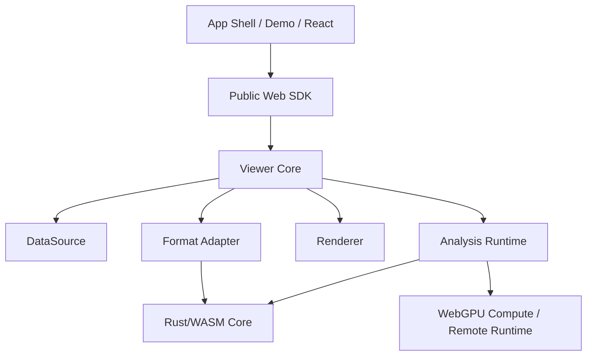
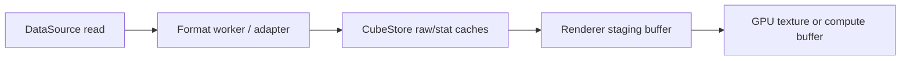

# CubeScope Architecture

## Overview

CubeScope should be built as a layered system:



The key architectural idea is separation of concerns:

1. Parsing is not rendering
2. Rendering is not analysis
3. Demo UI is not the public API

## Stable Abstractions

### 1. DataSource

The `DataSource` abstraction is responsible for byte access.

Supported implementations should eventually include:

- local `File` / `Blob`
- HTTP range requests
- object storage wrappers
- in-memory test fixtures

Suggested interface:

```ts
interface DataSource {
  id: string
  read(range: { start: number; end: number }): Promise<ArrayBuffer>
  size(): Promise<number>
  close?(): Promise<void>
}
```

### 2. FormatAdapter

`FormatAdapter` maps raw bytes into a cube-oriented model.

Responsibilities:

1. Parse metadata
2. Understand layout rules
3. Normalize band metadata such as names, wavelengths, and display hints
4. Normalize spatial metadata such as affine transforms and coordinate system descriptors
5. Provide band/tile/spectrum extraction services
6. Describe format capabilities

Suggested first-party adapters:

- `formats-envi`
- later: `formats-geotiff`, `formats-netcdf`, `formats-zarr`

### 3. CubeStore

`CubeStore` is the core read model used by the viewer and analysis layer.

Responsibilities:

1. Expose normalized metadata
2. Serve tile reads
3. Serve spectrum reads
4. Expose pixel-space and world-space mapping services when spatial metadata exists
5. Manage statistics cache
6. Hide format-specific details from upper layers

### 4. Renderer

The renderer draws already-prepared raster layers.

Responsibilities:

1. Texture upload
2. Tile placement
3. Colormap and stretch application
4. Layer composition
5. View transform application

Renderer variants:

- `renderer-webgpu`
- `renderer-webgl`

The core system should choose WebGPU first and fall back gracefully.

Renderer input contract:

1. The renderer accepts prepared raster tiles or layers plus view state.
2. The renderer does not parse source bytes, choose dataset bands, or own
   format-specific metadata normalization.
3. The renderer may own GPU-backed caches, but it must not own source-scoped
   metadata or statistics caches.
4. The renderer must be disposable at the source boundary without leaving live
   GPU resources behind.

### Spatial Metadata Boundary

CubeScope now treats geospatial support as a metadata-and-mapping concern first.

1. format adapters parse raw spatial fields such as ENVI `map info` and
   `coordinate system string`
2. metadata normalization derives a stable `spatialReference` object plus an
   affine transform when enough information exists
3. `CubeStore` and the public viewer may expose `pixelToWorld(...)` and
   `worldToPixel(...)` based on that affine transform
4. the renderer stays in pixel space and does not own CRS reprojection,
   geodetic transforms, or world-space raster warping

The affine mapper intentionally covers only source-space pixel/world
relationships. It preserves projection descriptors such as `coordinate system
string`, zone, hemisphere, datum, units, and raw `map info` tokens, but it does
not infer EPSG codes, apply ENVI rotation tokens, or perform proj4-style CRS
conversion. Those capabilities belong to a later geospatial layer above the
current viewer kernel.

### 5. Tool System

Tools control user interaction, not dataset structure.

Initial tools:

- pan
- zoom
- pixel probe
- ROI box
- ROI polygon
- layer visibility

### 6. Analysis Runtime

The analysis layer consumes `CubeStore` and emits results that can be rendered
or exported.

Runtime targets:

- `wasm-worker`
- `webgpu-compute`
- `remote`

This is the main expansion seam for future algorithms.

## Minimum Concrete Interface Floor

The documented seams now have a concrete internal floor in code. This floor is
intentionally small: it proves the boundary before the project widens into
additional formats or analysis runtimes.

```ts
interface FormatAdapter {
  parseHeader(input: {
    headerSource?: DataSource
    headerBytes?: Uint8Array
  }): Promise<CubeHeader>
  readTile(request: TileReadRequest): Promise<TileChunk>
  readSpectrum(request: SpectrumReadRequest): Promise<Float32Array>
}

interface CubeStore {
  getHeader(): CubeHeader
  getTile(request: TileReadRequest): Promise<TileChunk>
  getSpectrum(request: SpectrumReadRequest): Promise<Float32Array | null>
  unload(): Promise<void>
  pixelToWorld?(x: number, y: number): { x: number; y: number } | null
  worldToPixel?(x: number, y: number): { x: number; y: number } | null
}

type RendererInput = {
  sourceId: string
  viewState: unknown
  layers: unknown[]
  tiles: TileChunk[]
}

interface Renderer {
  render(input: RendererInput): Promise<void>
  disposeSource(sourceId: string): Promise<void>
  destroy(): void | Promise<void>
}
```

The point of this floor is not package count. It is to prevent architectural
boundaries from existing only in prose.

Current concrete floor in source:

- `src/sources/data-source.js`
- `src/formats/format-adapter.js`
- `src/formats/envi-format-adapter.js`
- `src/formats/envi-cube-reader.js`
- `src/store/cube-store.js`
- `src/rendering/renderer-contract.js`
- `src/rendering/webgpu-renderer.js`
- `src/rendering/webgl-renderer.js`
- `src/rendering/auto-renderer.js`
- `src/runtime/render-session.js`
- `src/runtime/work-scheduler.js`
- `src/runtime/worker-message-router.js`
- `src/runtime/runtime-reaction-plan.js`
- `src/runtime/runtime-work-executor.js`
- `src/runtime/runtime-lifecycle-controller.js`
- `src/runtime/runtime-transition-controller.js`
- `src/runtime/runtime-view-controller.js`
- `src/runtime/worker-dispatch-policy.js`
- `src/runtime/worker-pool.js`
- `src/runtime/runtime-policy.js`

Current alpha runtime adoption:

1. `src/runtime/viewer-runtime.js` now crosses the load path through
   `DataSource -> FormatAdapter -> CubeStore`
2. `src/formats/envi-format-adapter.js` now provides concrete
   `parseHeader`, `readTile`, and `readSpectrum` capabilities backed by shared
   ENVI cube read helpers rather than by worker-private byte-layout logic
3. `src/store/cube-store.js` now acts as the source-scoped cube read model for
   metadata, tile reads, spectrum reads, sampled statistics, and affine
   pixel/world mapping
4. `src/runtime/viewer-worker.js` now reconstructs a `CubeStore` for request
   execution and remains a protocol/cancellation boundary instead of owning
   ENVI-specific tile and spectrum extraction code inline
5. `src/runtime/viewer-runtime.js` now delegates draw calls and GPU tile
   resource ownership to renderer implementations behind
   `src/rendering/auto-renderer.js`
6. viewport state, render-slot state, and transition-slot commits are now
   isolated in `src/runtime/render-session.js`, so `viewer-runtime` no longer
   owns those details inline
7. worker idle-pool state plus tile/stats/preload queue bookkeeping now flow
   through `src/runtime/work-scheduler.js`, reducing how much source-scoped
   scheduling state remains inline inside `viewer-runtime`
8. worker envelope normalization and response classification now flow through
   `src/runtime/worker-message-router.js`, so `viewer-runtime` mainly handles
   the stateful side effects rather than inline message decoding
9. reaction planning for stats completion, tile completion, and tile error now
   flows through `src/runtime/runtime-reaction-plan.js`, so `viewer-runtime`
   no longer decides those runtime reactions inline after route classification
10. tile/stats/preload dispatch loops now flow through
   `src/runtime/runtime-work-executor.js`, so `viewer-runtime` no longer owns
   those worker execution loops inline
11. source teardown, metadata summary creation, and renderer device-loss
   recovery now flow through `src/runtime/runtime-lifecycle-controller.js`, so
   `viewer-runtime` no longer owns those lifecycle paths inline
12. band-switch planning, transition kickoff, and transition frame finalization
   now flow through `src/runtime/runtime-transition-controller.js`, so
   `viewer-runtime` no longer owns that transition orchestration inline
13. canvas resize, visible-tile calculation, and draw-loop scheduling now flow
   through `src/runtime/runtime-view-controller.js`, so `viewer-runtime` no
   longer owns that view-update orchestration inline
14. outgoing worker request ids, envelope construction, and command payload
   shaping now flow through `src/runtime/worker-dispatch-policy.js`, so
   `viewer-runtime` no longer assembles each worker message inline
15. worker creation, init handshake, fatal-error wiring, broadcast, and
   termination now flow through `src/runtime/worker-pool.js`, so
   `viewer-runtime` no longer owns the raw worker lifecycle inline
16. initial-load timing, band-switch timing, band-stats readiness planning, and
   preload planning now flow through `src/runtime/runtime-policy.js`, so
   `viewer-runtime` no longer owns that runtime policy state inline
17. renderer input is frozen as an internal contract helper before deeper
   renderer/store separation work in the next phase
18. ENVI `map info` and `coordinate system string` now normalize into a stable
   `spatialReference` contract, with affine pixel/world mapping exposed without
   entering renderer reprojection

## Analysis Architecture

Analysis should not be one giant module. It should be plugin-based.

### Algorithm categories

1. `pixel`
2. `roi`
3. `tile-stream`
4. `whole-cube`

### Algorithm runtime categories

1. `wasm-worker`
2. `webgpu`
3. `remote`

### Result categories

1. `spectrum`
2. `scalar`
3. `mask`
4. `raster`
5. `embedding`
6. `report`

### Why this matters

This lets future features like `SAM`, `PCA`, `MNF`, anomaly detection,
classification, and spectral unmixing fit into the system without rewriting the
viewer core.

## Worker Model

The current alpha already uses workers through a shared contract in
`src/protocol/worker-protocol.js`. A later refactor may promote that into a standalone
package once finer-grained internal modules are justified.

Current alpha command set in code:

- `init`
- `cancel`
- `calculate_stats`
- `load_tile`
- `get_spectrum`

Required next-step protocol additions before broader refactors:

- `parse_header`
- `run_analysis`

Recommended principle:

> All worker messages must use explicit typed schemas.

Required envelope floor:

```ts
type WorkerRequestEnvelope = {
  type: string
  sourceId: number
  requestId?: string
  payload: unknown
}

type WorkerResponseEnvelope = {
  type: string
  sourceId: number
  requestId?: string
  payload?: unknown
  error?: { message: string }
}
```

`cancel` semantics must be explicit:

1. `cancel` always targets a `requestId` and `sourceId`
2. after cancellation, a worker may drop temporary state for that request and
   must suppress any late result
3. the caller that issued `cancel` is responsible for clearing pending
   resolvers, loading state, and cache references tied to that request
4. switching source acts as an implicit cancel-all for the previous `sourceId`

Current alpha implementation floor:

1. the runtime tracks active worker request ids per source and broadcasts
   `cancel` for each tracked request on `unload()`, destroy, and source switch
2. the worker suppresses late `stats`, `tile`, and `spectrum` results for
   canceled requests and returns the worker to the idle pool through a
   `canceled` response
3. source mismatch on the main thread remains a second safety fence even after
   request-scoped cancellation

## Memory and Inter-Thread Data Flow

CubeScope will only remain credible on large cubes if binary ownership is
treated as an architecture rule rather than an implementation detail.

Recommended flow:



Rules:

1. Metadata and control messages may use structured clone.
2. Large binary payloads such as tiles, spectra, and intermediate raster
   buffers must not rely on implicit structured clone.
3. The default browser contract should use `Transferable` `ArrayBuffer`
   ownership transfer between workers and the main thread.
4. `SharedArrayBuffer` is an optional optimization for proven hot paths only,
   and only when cross-origin isolation is enabled. The public SDK must still
   work without it.
5. Every worker payload carrying binary data should declare enough schema
   information to be reconstructed without guessing, such as payload kind,
   typed-array family, shape, and ownership expectations.
6. Renderer upload buffers and GPU resources must be owned and disposed by the
   renderer layer, not leaked upward into application code.

Operational implication:

> A sender that transfers a large binary buffer must be treated as having given
> up ownership of that buffer.

## Cache Model

CubeScope should have multiple caches with clear ownership:

1. `metadata cache`
2. `stats cache`
3. `raw tile cache`
4. `render tile cache`
5. `analysis result cache`

Avoid one giant mutable cache map for everything.

Recommended default policies:

- `metadata cache`: source-scoped, small, retained until `unload()` or source
  switch
- `stats cache`: source-scoped, retained for the active cube, cleared on source
  change
- `raw tile cache`: viewport-aware LRU with byte budget, evict far-away tiles
  first
- `render tile cache`: renderer-owned GPU resource cache with explicit disposal
  on eviction, renderer switch, or device/context loss
- `analysis result cache`: keyed by source id + algorithm id + parameters, with
  explicit invalidation when upstream source, ROI, or layer inputs change

Recommended eviction rules:

1. Switching datasets clears every source-scoped cache.
2. Panning and zooming should prefer viewport-based retention plus bounded LRU,
   not unbounded historical growth.
3. Under memory pressure, raw tile and render tile caches should shrink before
   metadata cache.
4. GPU-backed cache entries must release their device resources immediately on
   eviction.

Current implementation status (2026-04-23):

1. `metadata cache` and `stats cache` are now concrete source-scoped runtime
   slices in `src/runtime/source-cache.js`, consumed by
   `src/runtime/viewer-runtime.js`
2. `render tile cache` is now renderer-owned in
   `src/rendering/webgpu-renderer.js`, with byte/tile budgets and immediate GPU
   disposal on eviction, source teardown, and device loss
3. `raw tile cache` policy is frozen in code, but the dedicated runtime slice
   remains a reserved seam until raw-byte caching is extracted from the current
   tile flow
4. `unload()` remains the public trigger that clears source-scoped caches

## Layer Model

Everything visual should become a layer.

Initial layer types:

- RGB image layer
- grayscale band layer
- mask layer
- analysis raster layer
- ROI overlay layer
- point marker layer

This is what will make analysis extensibility practical.

## Migration From Current Repository

Current files and suggested destination:

- `rust/envi-parser/src/*` -> `crates/envi-core`, `crates/cubescope-wasm`
- `src/runtime/viewer-worker.js` -> `packages/protocol`, `packages/core`, worker entry
- `src/runtime/viewer-runtime.js` -> split across `packages/core` and renderer packages
- `src/cube-viewer.js` -> `packages/web`
- `examples/*` -> `apps/demo`
- debug/performance panels -> `apps/demo`, not core packages

Internal directory boundaries may mirror future packages before those packages
are independently published. During `0.x`, prefer one public browser SDK and
keep fine-grained internal modules private until a second adapter, renderer, or
consumer justifies independent versioning.

## Current Weak Points To Correct

1. The remaining inline `viewer-runtime` shell still owns public-API glue,
   spectrum request flow, cancel/invalidation glue, worker bootstrap, and DOM
   interaction wiring; these are now explicit review surfaces
2. The internal seam floor now exists, but runtime residue should be named
   concretely instead of described only as "too much orchestration"
3. One stable public remote sample beyond the repo-local HTTP fixture is still absent
4. Node 22 local-runtime confirmation is still pending before the first public alpha tag

The auto renderer now treats WebGPU device loss as a session-level signal in
`auto` mode and prefers WebGL for subsequent recovery attempts; the remaining
browser work is wider matrix coverage, not basic degrade-path correctness. When
a browser requires a fresh drawing context to cross from WebGPU to WebGL, the
runtime now recreates the render canvas before recovering on the compatibility
path.

## Architecture Rules

These should be enforced early:

1. No demo component may read private viewer state
2. No analysis algorithm may directly manipulate renderer internals
3. No renderer may parse format-specific bytes
4. Public API changes require contract updates and fixtures
5. Every performance claim must have a benchmark path
6. No large binary payload may cross a thread boundary by accidental copy
7. Every cache slice must declare owner, budget, and invalidation behavior
