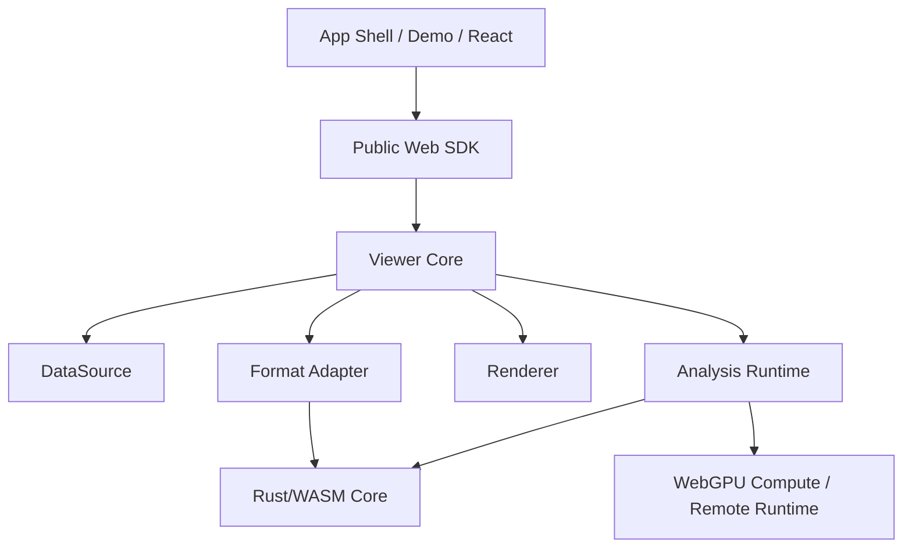

# CubeScope Architecture

## Overview

CubeScope should be built as a layered system:



The key architectural idea is separation of concerns:

1. Parsing is not rendering
2. Rendering is not analysis
3. Demo UI is not the public API

## Stable Abstractions

### 1. DataSource

The `DataSource` abstraction is responsible for byte access.

Supported implementations should eventually include:

- local `File` / `Blob`
- HTTP range requests
- object storage wrappers
- in-memory test fixtures

Suggested interface:

```ts
interface DataSource {
  id: string
  read(range: { start: number; end: number }): Promise<ArrayBuffer>
  size(): Promise<number>
  close?(): Promise<void>
}
```

### 2. FormatAdapter

`FormatAdapter` maps raw bytes into a cube-oriented model.

Responsibilities:

1. Parse metadata
2. Understand layout rules
3. Provide band/tile/spectrum extraction services
4. Describe format capabilities

Suggested first-party adapters:

- `formats-envi`
- later: `formats-geotiff`, `formats-netcdf`, `formats-zarr`

### 3. CubeStore

`CubeStore` is the core read model used by the viewer and analysis layer.

Responsibilities:

1. Expose normalized metadata
2. Serve tile reads
3. Serve spectrum reads
4. Manage statistics cache
5. Hide format-specific details from upper layers

### 4. Renderer

The renderer draws already-prepared raster layers.

Responsibilities:

1. Texture upload
2. Tile placement
3. Colormap and stretch application
4. Layer composition
5. View transform application

Renderer variants:

- `renderer-webgpu`
- `renderer-webgl`

The core system should choose WebGPU first and fall back gracefully.

### 5. Tool System

Tools control user interaction, not dataset structure.

Initial tools:

- pan
- zoom
- pixel probe
- ROI box
- ROI polygon
- layer visibility

### 6. Analysis Runtime

The analysis layer consumes `CubeStore` and emits results that can be rendered
or exported.

Runtime targets:

- `wasm-worker`
- `webgpu-compute`
- `remote`

This is the main expansion seam for future algorithms.

## Analysis Architecture

Analysis should not be one giant module. It should be plugin-based.

### Algorithm categories

1. `pixel`
2. `roi`
3. `tile-stream`
4. `whole-cube`

### Algorithm runtime categories

1. `wasm-worker`
2. `webgpu`
3. `remote`

### Result categories

1. `spectrum`
2. `scalar`
3. `mask`
4. `raster`
5. `embedding`
6. `report`

### Why this matters

This lets future features like `SAM`, `PCA`, `MNF`, anomaly detection,
classification, and spectral unmixing fit into the system without rewriting the
viewer core.

## Worker Model

The current project already uses workers well. The next version should formalize
that into a protocol package.

Recommended commands:

- `init`
- `parse_header`
- `compute_stats`
- `read_tile`
- `read_spectrum`
- `run_analysis`
- `cancel`

Recommended principle:

> All worker messages must use explicit typed schemas.

## Cache Model

CubeScope should have multiple caches with clear ownership:

1. `metadata cache`
2. `stats cache`
3. `raw tile cache`
4. `render tile cache`
5. `analysis result cache`

Avoid one giant mutable cache map for everything.

## Layer Model

Everything visual should become a layer.

Initial layer types:

- RGB image layer
- grayscale band layer
- mask layer
- analysis raster layer
- ROI overlay layer
- point marker layer

This is what will make analysis extensibility practical.

## Migration From Current Repository

Current files and suggested destination:

- `rust/envi_parser_Improved/src/*` -> `crates/envi-core`, `crates/cubescope-wasm`
- `src/lib/worker.js` -> `packages/protocol`, `packages/core`, worker entry
- `src/lib/hsi-wasm.js` -> split across `packages/core` and renderer packages
- `src/EnviViewer.js` -> `packages/web`
- `examples/*` -> `apps/demo`
- debug/performance panels -> `apps/demo`, not core packages

## Current Weak Points To Correct

1. Public wrapper and demo rely on different API surfaces
2. Renderer, scheduler, cache, and interaction logic are too tightly coupled
3. Performance and debug features live too close to product code
4. Build and package boundaries are not explicit

## Architecture Rules

These should be enforced early:

1. No demo component may read private viewer state
2. No analysis algorithm may directly manipulate renderer internals
3. No renderer may parse format-specific bytes
4. Public API changes require contract updates and fixtures
5. Every performance claim must have a benchmark path
