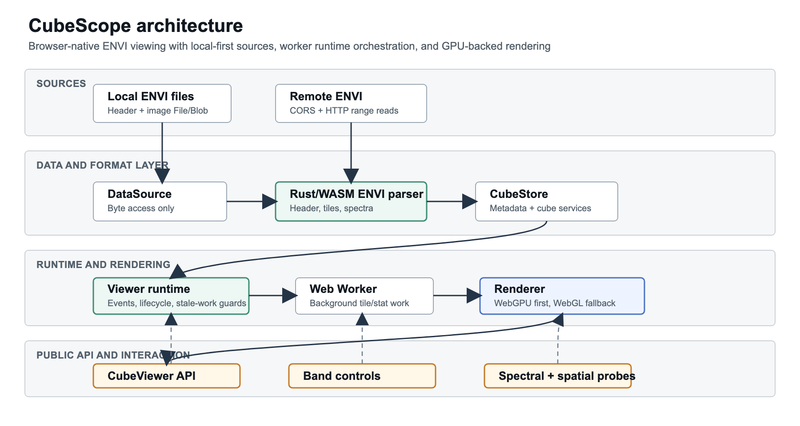
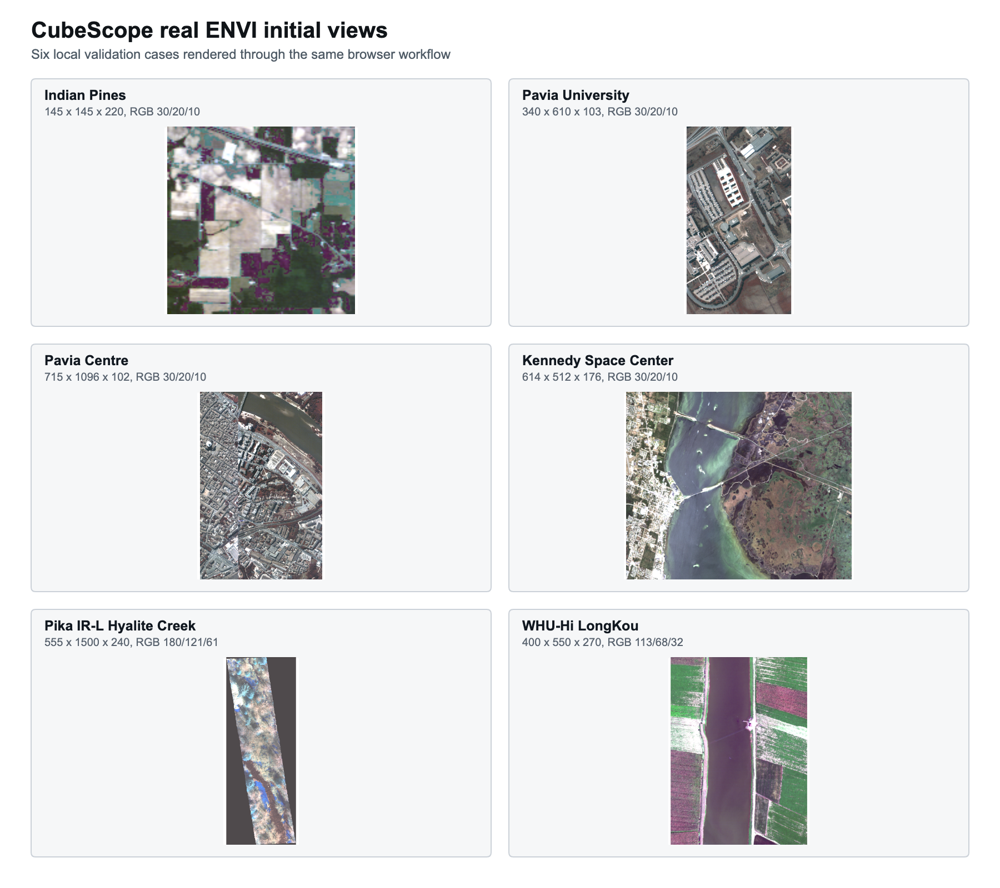

# CubeScope: a browser-native, local-first viewer kernel for ENVI hyperspectral datasets

## Title page draft

Article type: `Original software publication`

Full title: `CubeScope: a browser-native, local-first viewer kernel for ENVI hyperspectral datasets`

Short title: `CubeScope browser-native ENVI viewer kernel`

Authors: `Yongyin Leon Li`

Affiliations: `[To be completed with full postal addresses and country names]`

ORCID identifiers: `[To be completed]`

Corresponding author: `[To be completed]`

Corresponding author email: `[To be completed]`

Corresponding author full postal address: `[To be completed]`

Corresponding author phone number: `[To be completed]`

Present/permanent address notes: `[Add only if needed]`

## Abstract

CubeScope is a browser-native viewer kernel for ENVI hyperspectral datasets.
The software targets a gap between heavyweight desktop or server-centered
remote-sensing environments and lightweight web image viewers by providing
local-first, embeddable interaction with multi-band image cubes in modern
browsers. CubeScope combines a Rust/WebAssembly ENVI parser, Web Workers for
background loading and tile-oriented runtime work, and a hardware-accelerated
rendering path that prefers WebGPU while retaining a verified WebGL
compatibility fallback. The current alpha release supports local ENVI loading,
HTTP range-backed remote ENVI access, normalized cube metadata, spectral
probing, affine pixel-to-world coordinate mapping from ENVI spatial metadata,
and explicit runtime packaging for worker and WebAssembly assets. To support
reuse and evaluation, the repository also provides deterministic test fixtures,
public sample validation, benchmark commands, browser smoke tests, packaging
checks, and release-gating reports anchored to a reproducible Node 22
toolchain. Additional local validation on six real ENVI datasets, ranging from
`17.6 MB` to `381.1 MB`, produced successful initial views in all repeated
browser-load trials, with five runs per dataset. CubeScope is intentionally
scoped as an embeddable viewer kernel rather than a full analysis platform,
allowing downstream web applications to integrate hyperspectral browsing
without adopting a heavyweight backend stack.

## Keywords

`hyperspectral`; `ENVI`; `visualization`; `WebGPU`; `WebAssembly`;
`remote-sensing`; `scientific-software`

## 1. Motivation and significance

Hyperspectral data are widely used across remote-sensing and imaging
applications, but their high spectral dimensionality still creates practical
inspection and interaction challenges [1,2]. In many applied workflows, access
to hyperspectral cubes is mediated by desktop applications, notebook scripts,
or server-oriented geospatial systems. These approaches remain useful, but they
are often too heavy for one increasingly common task: quickly opening,
inspecting, and embedding multi-band image cubes inside scientific web
applications. Many research and engineering teams can preprocess ENVI data
offline, yet still lack a reusable browser-side viewer that preserves format
semantics and supports practical interaction.

CubeScope addresses this gap as a viewer kernel rather than as a complete
analysis platform. The current software artifact focuses on browser-native,
local-first ENVI viewing with a small embeddable API, validated rendering
paths, and reproducibility-oriented release practice. This scope is narrow on
purpose. The present contribution is not a full remote-sensing workbench, but a
reusable foundation for scientific web applications that need hyperspectral
viewing without immediately adopting a heavyweight backend stack.

This positioning also distinguishes CubeScope from adjacent web-facing
hyperspectral systems such as HSIToolbox, which targets the higher-level
problem of server-side hyperspectral classification workflows with dataset
management, labeling, remote training, and multi-user queueing [3]. CubeScope is
aimed at a different layer: a browser-native, local-first viewer kernel that
can be embedded into downstream applications, including future systems that may
add classification or analysis services above it.

## 2. Software description

### 2.1 Public software surface

The public package is `@cubescope/web`, and the main public class is
`CubeViewer`. The primary loading contract is `load(source)`, with two current
source modes: `envi-local` for paired local files and `envi-http` for remote
ENVI data served with browser-visible `CORS` and `HTTP range`. The ENVI support
is anchored to the format's paired ASCII header and flat binary image model,
including header fields such as interleave, wavelength, and default-band
metadata [4,5]. Within this scope, the alpha supports pseudo-RGB viewing, band
switching, normalized header access, spectral probing, explicit unloading, and
pixel/world coordinate mapping when ENVI spatial metadata is present.

The initial display band selection is intentionally conservative. CubeScope
uses valid ENVI `default bands` metadata when available, otherwise it uses
wavelength metadata to choose visible RGB-like bands when the spectrum covers
the visible range, or a spread false-color triplet for non-visible spectral
ranges. If neither metadata source is available, the runtime falls back to a
safe bounded default. This prevents small-band datasets from requesting
out-of-range bands while giving richer datasets a more informative first view.

### 2.2 Internal architecture

CubeScope is organized as a layered browser software stack. The public SDK
exposes a compact class-based interface. Beneath that surface, a viewer runtime
coordinates loading, events, workers, view updates, and renderer interaction.
Below the runtime, data access and format-specific services translate raw
source bytes into normalized cube metadata and read operations. Rendering then
consumes prepared raster and view state rather than direct source-format
details.

The main architectural seams are `DataSource`, `FormatAdapter`, `CubeStore`,
`Renderer`, and the runtime orchestration shell. `DataSource` is responsible
for byte access only, currently through local file/blob reads and an
HTTP-range remote path. `FormatAdapter` interprets ENVI source bytes, parses
metadata, and now provides concrete tile and spectrum extraction methods backed
by shared ENVI cube-read helpers. `CubeStore` exposes normalized metadata and
cube-oriented services such as tile reads, spectrum reads, sampled statistics,
and pixel/world mapping. Worker requests rebuild this store and execute through
that read model, so the worker remains a protocol and cancellation boundary
rather than the owner of ENVI byte-layout logic. `Renderer` consumes prepared
raster layers and view state and is explicitly separated from source parsing
and format semantics.

Figure 1. CubeScope architecture. Local and HTTP-range ENVI sources are reduced
to byte access, interpreted through the Rust/WebAssembly ENVI parser, exposed
through normalized cube services, orchestrated by the viewer runtime and worker
layer, and rendered through WebGPU or WebGL behind the public `CubeViewer` API.

### 2.3 Implementation choices

The implementation combines Rust/WebAssembly, Web Workers, and browser GPU
rendering in a practical way. ENVI parsing is anchored in a Rust/WebAssembly
component that serves as the authoritative parser layer for the current format
support. Background work is routed through Web Workers using explicit message
envelopes and source-aware request tracking, which helps isolate stale work
when sources change. Rendering is WebGPU-preferred but retains a validated WebGL
compatibility and recovery path. In `auto` mode, the viewer prefers WebGPU but can recover
through WebGL after a device-loss event, including cases where the browser
requires the render canvas to be recreated before a new graphics context can be
used.

Spatial support follows a conservative but useful boundary. ENVI `map info` and
`coordinate system string` fields are normalized into
`CubeHeader.spatialReference`, and where possible the software derives an
affine transform that powers `pixelToWorld()` and `worldToPixel()` in
zero-based image pixel space. Projection descriptors such as datum, zone,
hemisphere, units, and coordinate-system strings are preserved as metadata, but
the current alpha does not infer EPSG identifiers, apply rotation tokens, or
perform full coordinate reference system conversion or real-time reprojection.

### 2.4 Availability and quality control

Reproducibility is treated as part of the software contribution. CubeScope uses
Node `22.x` as the official release and reproducibility baseline, while newer
Node versions may still be used for local development. In the current validated
local environment, the repository was checked under Node `v22.22.2`, npm
`10.9.7`, and a Rust toolchain with the `wasm32-unknown-unknown` target plus
`wasm-bindgen-cli 0.2.100`.

The validation workflow is repository visible and command-oriented. A
reproducible local run starts with dependency installation and deterministic
fixture generation, then proceeds through Rust/WASM rebuilding, browser-SDK
building, contract tests, browser smoke tests, browser-matrix reporting,
benchmark collection, sample validation, package-consumer verification, and
alpha summary reporting. These steps generate machine-readable evidence under
`output/`, including benchmark results, browser-matrix results, sample reports,
pack-consumer verification, and a consolidated alpha status snapshot.

The repository ships a deterministic synthetic ENVI fixture for repeatable
smoke tests and benchmarks, and it also includes one validated public remote
ENVI sample, `snowex-aviris-ng-sasp`, which is exercised through the
browser-facing `envi-http` workflow. Candidate public samples must pass a
qualification and validation workflow that checks both transport behavior and
browser usability.

At submission time, the software distribution should be exposed through a public
GitHub repository with a well-formed `README.md`, license information, and a
tagged release associated with the manuscript.

## 3. Illustrative examples

The simplest CubeScope workflow is local ENVI loading. A downstream application
creates a `CubeViewer`, initializes it, and calls
`load({ kind: 'envi-local', ... })` with the header and data files. Once
loaded, the viewer exposes normalized metadata, renders a pseudo-RGB view,
allows band switching, and returns a spectral profile for pixel inspection.

The same viewer contract also supports remote ENVI access through `HTTP range`.
In that case the source is described by `headerUrl` and `dataUrl` rather than
local file handles. This path still depends on browser-visible `CORS` and
`HTTP range`, but it allows a web application to interact with ENVI data
without first downloading the full data object eagerly.

When ENVI spatial metadata is present, the application can also retrieve
pixel/world mappings through `pixelToWorld()` and `worldToPixel()`. This
supports coordinate-aware inspection while keeping the render path anchored to
source pixel space.

For manuscript preparation, the example application was also exercised with
six local real ENVI datasets, including agricultural, urban, wetland, airborne
near-infrared, and UAV hyperspectral scenes. These cases are used as
illustrative validation examples rather than redistributed test assets. The
resulting screenshots show that the first rendered view is non-blank and
visually interpretable across BIP and BSQ layouts, floating-point and unsigned
integer data, and both metadata-poor and wavelength-described headers.
Candidate provenance sources for these local validation cases include the
Indian Pines/Purdue MultiSpec source [6], the EHU/GIC Pavia and KSC benchmark
collection [7], Resonon Pika IR-L documentation for the near-infrared sensor
family [8], and the WHU-Hi LongKou publication [9].

## 4. Early evaluation

The current evaluation is a software-release check rather than a full systems
benchmark study. The goal is to show that browser-native hyperspectral
interaction is practical and reproducible. Benchmark reports were generated in a
macOS environment using Node `v22.22.2`, Chromium `147.0.7727.15`, and a
deterministic ENVI fixture with dimensions `48 x 48 x 32`.

The benchmark harness records three early metrics: header parse time, time to
initial view, and band-switch time. In the local-file scenario, the measured
values are approximately `6.5 ms`, `17.1 ms`, and `3.0 ms`, respectively. In
the same-origin remote scenario using `HTTP range`, the values are
approximately `5.5 ms`, `21.3 ms`, and `5.5 ms`. These are reported as
direct validation outputs, not as polished comparative benchmarks.

The browser-matrix report adds evidence for renderer behavior. In the current
local Chromium verification, both a forced `webgl` scenario and an `auto`
scenario passed. In the `auto` scenario, the recorded renderer state shows an
observed transition from `webgpu` to `webgl` after a device-loss event, with
the session completing in a recovered state. This is not yet a broad browser or
hardware comparison, but it does show that the compatibility path is exercised
through an actual browser workflow.

To complement the deterministic fixture, six real ENVI datasets were loaded
through the example application using Chromium, `renderer=webgl`, and
`benchmark=1`. Each case was run five times on the same local machine, and the
table reports the median and interquartile range of time to initial view. All
cases reached an initial rendered view in all five runs.

Table 1. Local real ENVI validation cases. Initial-view time is reported as
median (IQR) in milliseconds across five browser loads. Local source data were
used only for manuscript-side validation and are not redistributed with the
software package.

| Dataset | Dimensions | Interleave | Type | Data size | Spatial metadata | Initial RGB bands | Successful runs | Initial view time |
| --- | --- | --- | --- | --- | --- | --- | ---: | ---: |
| Indian Pines | `145 x 145 x 220` | `bip` | `f32` | `17.6 MB` | no | `30/20/10` | `5/5` | `45.4 (7.1)` |
| Pavia University | `340 x 610 x 103` | `bip` | `f32` | `81.5 MB` | no | `30/20/10` | `5/5` | `130.3 (4.4)` |
| Pavia Centre | `715 x 1096 x 102` | `bip` | `f32` | `304.9 MB` | no | `30/20/10` | `5/5` | `399.0 (4.0)` |
| Kennedy Space Center | `614 x 512 x 176` | `bip` | `f32` | `211.1 MB` | no | `30/20/10` | `5/5` | `389.7 (7.0)` |
| Pika IR-L Hyalite Creek | `555 x 1500 x 240` | `bip` | `u16` | `381.1 MB` | yes | `180/121/61` | `5/5` | `458.5 (5.4)` |
| WHU-Hi LongKou | `400 x 550 x 270` | `bsq` | `f32` | `226.6 MB` | no | `113/68/32` | `5/5` | `27.8 (21.0)` |

Figure 2. Real ENVI initial views rendered by CubeScope for the six local
validation cases. The panels are generated from browser screenshots of the
example application. Source datasets are used only for manuscript-side
validation and are not redistributed with the software package.

These results should be interpreted as practical evidence that the alpha
runtime can open and render varied real ENVI cubes in a browser workflow, not
as a hardware-independent performance claim. Several legacy benchmark datasets
do not provide wavelength or default-band metadata, so their initial colors
use CubeScope's safe pseudo-RGB fallback. The Pika and WHU-Hi cases include
wavelength metadata, and therefore demonstrate the metadata-aware initial band
selection path.

## 5. Impact and limitations

CubeScope lowers the barrier to browser-based hyperspectral viewing. Users and
teams do not need to adopt a heavyweight remote backend or a full desktop
analysis environment simply to inspect ENVI data in a browser. This makes the
software relevant for exploratory work, review interfaces, annotation tools,
quality-control utilities, and educational applications.

The project also has reuse value beyond the repository demo. Because CubeScope
is packaged as a viewer kernel with explicit runtime assets and an embeddable
public API, it can serve as infrastructure for downstream scientific web
applications. The current release also establishes a stable architectural base
for later work on multispectral support, richer spatial overlays, additional
source formats, and lightweight analysis plugins.

The limitations are equally important to state clearly. The software is
currently ENVI-first rather than broadly multi-format. The main artifact is a
browser SDK, so users working only in Python or desktop environments still need
an integration layer. The remote workflow depends on compatible `CORS` and
`HTTP range` behavior at the serving endpoint. The benchmark scope is
intentionally narrow and should not be mistaken for a full comparative systems
study. The real-data validation cases were loaded from local files and are not
redistributed with the repository, so their screenshot and timing evidence
should be treated as manuscript-side validation rather than as a complete
public benchmark suite. The current alpha is also not yet a complete
scientific analysis environment.

## 6. Conclusions

CubeScope shows that browser-native hyperspectral viewing can already be
packaged as serious research software without waiting for a full remote-sensing
analysis platform. The current alpha provides a reproducible, embeddable ENVI
viewer kernel built around a Rust/WebAssembly parser, worker-oriented runtime
execution, and hardware-accelerated browser rendering with a validated fallback
path. It pairs that runtime with fixtures, public-sample validation, packaging
checks, benchmark commands, and release-gating reports that improve inspection,
reuse, and citation potential. The additional real ENVI validation cases show
that the same runtime path can produce initial views for selected
agricultural, urban, wetland, airborne, and UAV hyperspectral scenes.

Within its current scope, CubeScope already contributes a meaningful software
base for downstream web applications that need hyperspectral viewing without a
heavy backend stack. Near-term work should widen capability carefully through
multispectral support, richer spatial overlays, additional source adapters, and
later analysis-oriented extensions.

## Data statement

No new experimental datasets were generated for this software paper. The
repository includes deterministic validation fixtures, benchmark outputs,
browser-matrix reports, sample-validation reports, and packaging-verification
artifacts as part of the software release and reproducibility workflow. Local
real ENVI datasets were used to prepare illustrative screenshots and timing
summaries for the manuscript, but those source data files are excluded from Git
and are not redistributed with the software package. If additional
submission-system wording is required, this section should be aligned with the
final public repository, release archive, and the licensing terms of any
externally obtained datasets.

## Software availability

Repository: `https://github.com/yongyin-leon/CubeScope`

Version: `0.1.0-alpha.1`

License: `MIT`

Primary package: `@cubescope/web`

Permanent software reference: `[DOI or release landing page if available]`

## Funding

`[To be completed. If none: This research did not receive any specific grant from funding agencies in the public, commercial, or not-for-profit sectors.]`

## CRediT author statement

`[To be completed using CRediT roles such as Conceptualization, Software, Validation, Visualization, Writing - original draft, Writing - review and editing, etc.]`

## Declaration of competing interest

The authors declare that they have no known competing financial interests or
personal relationships that could have appeared to influence the work reported
in this paper. `[Revise if needed before submission.]`

## Declaration of generative AI and AI-assisted technologies in the manuscript preparation process

`[Include this section only if disclosure is required under the final author decision. Suggested pattern: During the preparation of this work the author(s) used [NAME OF TOOL / SERVICE] in order to [REASON]. After using this tool/service, the author(s) reviewed and edited the content as needed and take(s) full responsibility for the content of the published article.]`

## Acknowledgements

`[To be completed. Keep this section directly before the references list in the final manuscript.]`

## References

1. Signoroni, A., Savardi, M., Baronio, A., & Benini, S. (2019). Deep
   Learning Meets Hyperspectral Image Analysis: A Multidisciplinary Review.
   `Journal of Imaging`, 5(5), 52. https://doi.org/10.3390/jimaging5050052

2. Ghamisi, P., Yokoya, N., Li, J., Liao, W., Liu, S., Plaza, J., Rasti, B.,
   & Plaza, A. (2017). Advances in hyperspectral image and signal processing:
   A comprehensive overview of the state of the art. `IEEE Geoscience and
   Remote Sensing Magazine`, 5(4), 37-78.
   https://doi.org/10.1109/MGRS.2017.2762087

3. Dhaene, Z., Zizakic, N., Huang, S., Li, X., & Pizurica, A. (2023).
   HSIToolbox: A web-based application for the classification of hyperspectral
   images. `SoftwareX`, 22, 101340.
   https://doi.org/10.1016/j.softx.2023.101340

4. NV5 Geospatial. ENVI Header Files. ENVI Documentation. Accessed
   2026-04-24.
   https://www.nv5geospatialsoftware.com/docs/enviheaderfiles.html

5. NV5 Geospatial. ENVI Image Files. ENVI Documentation. Accessed 2026-04-24.
   https://www.nv5geospatialsoftware.com/docs/ENVIImageFiles.html

6. Purdue University MultiSpec. Hyperspectral Images. Indian Pine Test Site
   AVIRIS data, Purdue University Research Repository DOI `10.4231/R7RX991C`.
   Accessed 2026-04-24.
   https://engineering.purdue.edu/~biehl/MultiSpec/hyperspectral.html

7. Grupo de Inteligencia Computacional, University of the Basque Country.
   Hyperspectral Remote Sensing Scenes. Accessed 2026-04-24.
   https://www.ehu.eus/ccwintco/index.php?title=Hyperspectral_Remote_Sensing_Scenes

8. Resonon. Pika IR-L (925-1700nm). Accessed 2026-04-24.
   https://resonon.com/Pika-IR-L

9. Zhong, Y., Hu, X., Luo, C., Wang, X., Zhao, J., & Zhang, L. (2020).
   WHU-Hi: UAV-borne hyperspectral with high spatial resolution (H2) benchmark
   datasets and classifier for precise crop identification based on deep
   convolutional neural network with CRF. `Remote Sensing of Environment`,
   250, 112012. https://doi.org/10.1016/j.rse.2020.112012
