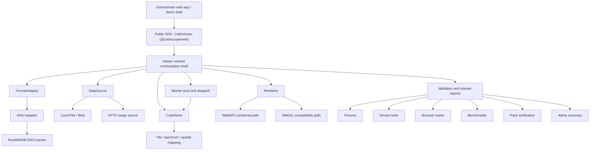
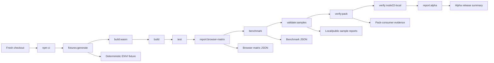
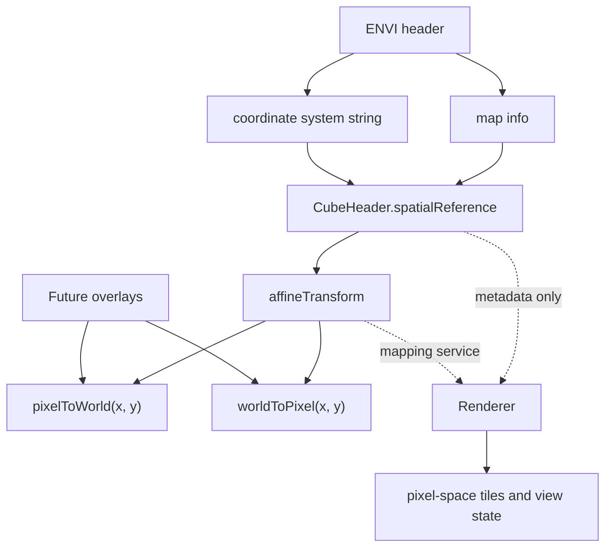

# CubeScope Software Paper Draft v1

This document is the first manuscript-facing draft for the Track A software
paper. It is written to fit a `SoftwareX`-style structure first, while keeping
the core story compact enough to later compress into a `JOSS`-style submission
if needed.

## Submission Positioning

- primary target: `SoftwareX`
- backup path: `JOSS`
- paper type: research software / scientific software paper
- paper goal: establish `CubeScope` as citable, reusable browser-native
  hyperspectral viewing software

## Recommended Claim Boundary

The paper should describe `CubeScope` as:

- a browser-native, local-first, hardware-accelerated viewer kernel
- currently focused on ENVI hyperspectral datasets
- embeddable into downstream web applications
- supported by reproducible build, test, benchmark, and packaging workflows

The paper should not describe `CubeScope` as:

- a full remote-sensing analysis platform
- a general-purpose GIS system
- a complete cloud-native geospatial stack
- a mature scientific analysis suite

This boundary matters because the current alpha release is strongest as a
well-engineered viewer kernel with reproducible software-release practice.

## Working Title Candidates

1. `CubeScope: a browser-native, local-first viewer kernel for ENVI hyperspectral datasets`
2. `CubeScope: reproducible browser-native viewing software for ENVI hyperspectral cubes`
3. `CubeScope: an embeddable Rust/WASM and WebGPU-enabled viewer for ENVI hyperspectral data`

Recommendation:

- use title `1` for the first full draft
- keep title `2` as the safer fallback if the submission should emphasize
  software reuse and reproducibility more than implementation detail

## Draft Abstract

CubeScope is a browser-native viewer kernel for ENVI hyperspectral datasets.
The software addresses a gap between heavyweight desktop or server-centered
remote-sensing environments and lightweight web image viewers by providing
local-first, embeddable interaction with multi-band image cubes in modern
browsers. CubeScope combines a Rust/WebAssembly ENVI parser, Web Workers for
background loading and tile-oriented runtime work, and a hardware-accelerated
rendering path that prefers WebGPU while retaining a verified WebGL
compatibility fallback. The current alpha release supports local ENVI loading,
HTTP range-backed remote ENVI access, normalized cube metadata, spectral
probing, affine pixel-to-world coordinate mapping from ENVI spatial metadata,
and explicit runtime packaging for worker and WebAssembly assets. To support
reuse and evaluation, the repository also provides deterministic test fixtures,
public sample validation, benchmark commands, browser smoke tests, packaging
checks, and release-gating reports anchored to a reproducible Node 22
toolchain. CubeScope is intentionally scoped as an embeddable viewer kernel
rather than a full analysis platform, allowing downstream web applications to
integrate hyperspectral browsing without adopting a heavyweight backend stack.
This paper describes the software architecture, implementation choices,
reproducibility strategy, and current alpha capability boundary, and it
positions CubeScope as a foundation for later multispectral, geospatial, and
analysis-oriented extensions.

## Optional Short Abstract Variant

Use this only if the journal or submission system demands a tighter abstract.

CubeScope is a browser-native, local-first viewer kernel for ENVI
hyperspectral datasets. It combines a Rust/WebAssembly parser, Web Workers, and
hardware-accelerated rendering with WebGPU-first and WebGL-compatible paths to
support embeddable cube viewing in modern browsers. The current alpha release
supports local and HTTP range-backed remote ENVI loading, normalized metadata,
spectral probing, affine pixel-to-world mapping, and reproducible build, test,
benchmark, and packaging workflows. CubeScope is intentionally scoped as a
viewer kernel rather than a full analysis platform, providing a reusable base
for downstream scientific web applications and later multispectral,
geospatial, and analysis-focused extensions.

## Contribution Framing

The paper should make three primary contribution claims:

1. `CubeScope` provides a browser-native software path for ENVI hyperspectral
   viewing that does not require a heavyweight backend stack.
2. `CubeScope` exposes a reusable viewer-kernel architecture with explicit
   boundaries between data access, format handling, runtime orchestration, and
   rendering.
3. `CubeScope` treats reproducibility as part of the software contribution by
   shipping fixtures, validation workflows, packaging checks, benchmark
   commands, and citation metadata.

### 1. Introduction

Hyperspectral remote-sensing workflows are still dominated by heavyweight
desktop applications, notebook-centered scripting environments, or
server-centered geospatial stacks. These ecosystems remain valuable, but they
also impose practical friction when users need fast visual inspection, lightweight
sharing, browser-based review, or integration into custom scientific web
interfaces. In practice, teams that can already process hyperspectral data in
Python or desktop software often still lack a reusable browser-side viewer that
can be embedded into downstream applications without rebuilding the entire data
access, metadata, and rendering stack.

Recent browser capabilities have made a different software path plausible.
WebAssembly, Web Workers, and modern GPU APIs enable a browser runtime that is
far more capable than the image-viewing model that shaped earlier web tools.
However, many browser-oriented examples remain either thin demonstrations or
tightly coupled application code, which makes them difficult to reuse as
research software. For hyperspectral imaging in particular, the gap is not only
about rendering pixels. It also includes handling ENVI metadata, preserving
format semantics, supporting spectrum-oriented interaction, and keeping runtime
latency low enough for practical exploratory use.

Recent software papers have addressed adjacent problems from a different system
position. For example, HSIToolbox presents a web-based application for
hyperspectral image classification with dataset management, labeling, server-side
deep learning training, and multi-user queueing on dedicated hardware. That is a
useful and credible contribution, but it occupies a higher application layer
than the one targeted here. CubeScope does not try to be a classification
platform, training service, or microservice-based remote workbench. Instead, it
focuses on the lower-level problem of providing a browser-native, local-first,
embeddable viewer kernel that other web applications can integrate, including
future systems that may themselves add labeling, analytics, or model-serving
layers.

CubeScope is designed to address this gap as a viewer kernel rather than a full
analysis platform. The project focuses on the part of the problem that is both
widely reusable and currently under-served: browser-native, local-first viewing
of ENVI image cubes with explicit runtime packaging, hardware-accelerated
rendering, and a small embeddable public API. This scope is deliberate. It lets
the software contribute something concrete and reusable now, while leaving room
for later multispectral, geospatial, and analysis-oriented expansion without
forcing those concerns into the first public release.

The contribution of this paper is therefore software-oriented rather than
algorithmic. It presents CubeScope as a browser-native ENVI viewer kernel, with
an architecture that separates byte access, format adaptation, cube-oriented
read services, runtime orchestration, and rendering. It also treats
reproducibility as part of the contribution by documenting a stable runtime
baseline, deterministic fixtures, packaging checks, browser smoke tests, and a
small benchmark harness. In short, the paper argues that a reusable
hyperspectral viewing core can already be a meaningful research-software output
before the broader analysis platform exists.

### 2. Software Overview and Scope

#### 2.1 Design goals

CubeScope is guided by five design goals: browser-native execution, local-first
use, hardware-accelerated interaction, embeddable SDK boundaries, and
reproducible release practice. Browser-native means the software should operate
inside standard modern browsers rather than depending on a custom desktop shell
or mandatory remote backend. Local-first means the primary workflow should not
require server preprocessing or cloud deployment just to inspect a dataset.
Hardware-accelerated means the viewer should exploit modern browser rendering
paths while still retaining a compatibility fallback. Embeddable means the
software should be usable as a package inside another web application rather
than only as a standalone demo. Reproducible means that build, test,
benchmarking, runtime packaging, and citation metadata are treated as first-class
software outputs.

#### 2.2 Current supported workflow

The current alpha release is intentionally narrow. The stable public package is
`@cubescope/web`, and its main public class is `CubeViewer`. The primary loading
entry point is `load(source)`, where `source` currently supports two ENVI-first
workflows: `envi-local` for paired local files and `envi-http` for remote ENVI
assets served with browser-visible `CORS` and `HTTP range` support. Within that
scope, the viewer already supports pseudo-RGB rendering, band switching,
metadata access through a normalized `CubeHeader`, pixel-spectrum probing, and
source-space pixel/world coordinate mapping when spatial metadata is available.

This workflow is broad enough to be useful in practice and small enough to stay
honest. CubeScope is not trying to present an alpha surface that promises more
than the implementation can actually support. The package exposes explicit
worker and WebAssembly asset paths, documents how to integrate them into
bundler-based applications, and keeps compatibility aliases such as
`loadFile(...)` and `EnviViewer` only as transitional conveniences during the
`0.x` line. The intent is to stabilize a compact browser SDK now, rather than
commit prematurely to a sprawling public API.

#### 2.3 Deliberate non-goals for this paper

Several capabilities are deliberately outside the scope of the present paper
and release. CubeScope is not yet a full remote-sensing analysis platform; it
does not attempt to provide a large algorithm library, workflow management, or
publication-grade scientific export layers. It is also not a general GIS engine
and does not currently attempt real-time reprojection rendering in world space.
Spatial support is limited, by design, to metadata normalization and affine
pixel/world mapping. Likewise, although the architecture is intended to widen
toward additional remote-sensing formats, the current software paper remains
ENVI-first rather than claiming broad format coverage that the implementation
has not yet earned.

These non-goals strengthen rather than weaken the paper. They help define the
software contribution clearly: a reproducible, embeddable viewer kernel for
ENVI hyperspectral cubes in the browser. That is already a coherent and useful
piece of scientific software, and it provides a stable base for later
extensions. It also distinguishes CubeScope from web-facing hyperspectral
systems whose main contribution lies in server-side model training or end-to-end
classification workflow management. The present paper is narrower and more
infrastructural by design.

### 3. Software Architecture and Implementation

#### 3.1 High-level architecture

CubeScope is organized as a layered browser software stack. At the public edge,
the SDK exposes a compact class-based API centered on `CubeViewer`. Beneath
that public layer sits a viewer runtime responsible for orchestration rather
than format ownership. The runtime coordinates loading, event emission, worker
activity, view updates, and renderer interaction, but it does not collapse all
responsibilities into a single monolith. Under that layer sit the data access
and format-specific services that translate raw source bytes into normalized
cube metadata and read operations. Rendering then consumes prepared raster and
view state rather than source-format details. Around all of this sits a release
and validation layer that includes fixtures, smoke tests, browser-matrix
checks, packaging verification, benchmark commands, and alpha reporting.

This architecture matters because CubeScope is intended to be reused by other
applications. A viewer kernel that mixes demo controls, source parsing, cache
state, worker messaging, and GPU logic into a single implementation may still
work as an internal prototype, but it becomes difficult to trust as research
software. CubeScope therefore treats boundary discipline as part of the product:
parsing is not rendering, rendering is not analysis, and demo UI is not the
public API.

#### 3.2 Core architectural seams

The core seams are `DataSource`, `FormatAdapter`, `CubeStore`, `Renderer`, and
the runtime orchestration shell. `DataSource` is responsible only for byte
access. In the current alpha this includes local `File` or `Blob` access and an
HTTP-range-backed remote path. `FormatAdapter` converts byte-oriented sources
into cube-aware operations. In the current system, the first-party adapter is
ENVI-focused and is responsible for parsing metadata, understanding storage
layout, and supporting tile and spectrum extraction. `CubeStore` acts as the
read model used by upper layers: it exposes normalized metadata, serves tile and
spectrum requests, and handles source-space coordinate mapping when spatial
metadata exists. `Renderer` receives prepared raster layers and view state and
is deliberately separated from format parsing and source-specific metadata
ownership.

The runtime shell coordinates these pieces without owning all of their internal
logic. Earlier in the project, `viewer-runtime` had accumulated too much inline
state and too many cross-cutting responsibilities. The current alpha has
already reduced that coupling by extracting render-session management, work
scheduling, worker-pool lifecycle, dispatch policy, response routing, reaction
planning, lifecycle handling, transition handling, and view updates into
separate internal modules. This refactoring is not presented as academic novelty
in itself, but it is important for software quality because it keeps the public
SDK stable while allowing internal evolution.

#### 3.3 Runtime implementation

The implementation combines several browser-era technologies in a way that is
practical rather than ornamental. ENVI metadata parsing is anchored in a
Rust/WebAssembly component, which serves as the authoritative parser layer for
the current format support. Runtime work that should not block the main thread
is routed through Web Workers. This includes loading-related tasks and
tile-oriented viewer work, with explicit message envelopes and source-aware
request tracking to prevent stale results from contaminating the active source
state. Large binary transfers use browser-friendly ownership rules rather than
silently assuming that structured cloning cost is irrelevant.

Rendering is hardware-accelerated and WebGPU-first, but the alpha does not
pretend that WebGPU availability is universal. CubeScope therefore retains a
WebGL compatibility renderer and now treats fallback as part of the real product
path rather than a theoretical backup. In `auto` mode, the current viewer
session prefers WebGPU, but if a device-loss event occurs, recovery can proceed
through WebGL. The implementation also accounts for a real browser constraint:
some browsers require a fresh drawing context when crossing from a lost WebGPU
state into WebGL, so the recovery path can recreate the render canvas before
continuing. This makes the compatibility story concrete and testable rather than
aspirational.

#### 3.4 Spatial metadata slice

Spatial support in the current alpha follows a deliberately conservative
boundary. ENVI fields such as `map info` and `coordinate system string` are
parsed and normalized into a stable `CubeHeader.spatialReference` object.
Where possible, the software derives an affine transform and exposes
`pixelToWorld()` and `worldToPixel()` through the public viewer contract. This
is enough to support coordinate-aware inspection and to prepare for later
overlay-oriented work.

Just as important is what CubeScope does not do here. The renderer still
operates in pixel space. The software does not yet attempt full coordinate
reference system conversion, real-time reprojection, or world-space raster
warping. That decision preserves rendering simplicity and keeps the geospatial
story honest at the current maturity level. For a software paper, this is the
right tradeoff: the project already demonstrates meaningful spatial metadata
support without overstating its present scope.

### 4. Reproducibility, Packaging, and Quality Assurance

#### 4.1 Release and runtime policy

CubeScope treats release engineering as part of the software contribution rather
than post hoc project hygiene. The current alpha is published as a single public
browser SDK package, `@cubescope/web`, with explicit runtime assets for the
worker bundle and the WebAssembly parser runtime. This is an important design
choice for reuse. Browser-oriented scientific packages often fail in downstream
integration not because their core logic is unusable, but because worker and
runtime assets are hidden behind repository-specific assumptions. CubeScope
therefore documents these assets as part of the supported package surface.

The project also adopts an explicit runtime support policy. Node `22.x` is the
official baseline for release gating and reproducibility claims, even though
newer Node versions may still be used for day-to-day local development. This
policy keeps the software aligned with a long-term-support runtime and reduces
ambiguity when describing verified build and validation behavior in a paper or
release note. In the current local verification environment, the validated
runtime is Node `v22.22.2` with npm `10.9.7`, and the supporting Rust toolchain
includes the `wasm32-unknown-unknown` target plus `wasm-bindgen-cli 0.2.100`.

#### 4.2 Validation workflow

The reproducibility workflow is intentionally command-oriented and repository
visible. A fresh local validation path starts with dependency installation and
deterministic fixture generation, then proceeds through Rust/WASM rebuilding,
browser-SDK build output, contract tests, browser smoke tests, benchmark
collection, remote-sample validation, package-consumer verification, and alpha
summary reporting. Rather than scatter these steps across informal notes, the
repository records them in explicit commands and machine-readable outputs.

This validation model produces several artifacts that are useful for both
development and publication. Benchmark outputs are written to
`output/benchmark/latest.json`; the local browser-matrix report is written to
`output/browser-matrix/latest.json`; remote-sample checks are recorded under
`output/samples/`; packaging verification from an isolated consumer application
is recorded under `output/pack-consumer/latest.json`; and a consolidated alpha
status snapshot is written to `output/alpha/local-alpha-summary.json`. Together,
these outputs let the project claim not only that the software can be built, but
that its supported runtime, packaging surface, and browser behavior have been
checked in a reproducible way.

One useful property of this workflow is that it also validates embeddability.
The isolated consumer check confirms that the packaged tarball exports the
expected public surface and includes the runtime assets needed by downstream
applications. In the current alpha snapshot, these verified assets include the
ES module build, the worker bundle, the WebAssembly parser files, the fixture
payloads used for validation, the remote-sample catalog, and citation metadata.
That is especially relevant for a software paper because it turns reusability
from an aspiration into something that has at least been exercised beyond the
source tree itself.

#### 4.3 Public sample and legal reproducibility

CubeScope currently uses a dual-sample reproducibility strategy. First, the
repository ships a deterministic synthetic ENVI fixture that is regenerated from
source and used for smoke tests, browser automation, and early benchmark
collection. This fixture is intentionally small and controlled; it is meant to
support repeatable validation rather than broad scientific representativeness.
Second, the repository now also ships one validated public remote ENVI sample,
`snowex-aviris-ng-sasp`, which is exercised through the same browser-facing
workflow and recorded in the public sample validation report.

The distinction between these two sample classes matters. The synthetic fixture
gives the project a deterministic baseline that is not vulnerable to external
hosting changes. The public sample, by contrast, helps demonstrate that the
remote-read path is not only a local demonstration. To keep that public-sample
story honest, CubeScope includes a qualification and promotion workflow for
candidate remote samples rather than treating any reachable ENVI file as
publication-ready evidence. This workflow checks transport behavior such as
header accessibility and `HTTP range` support, and it also verifies that the
sample remains browser-usable in the demo path.

### 5. Illustrative Usage Scenarios

The simplest CubeScope workflow is local browser loading of an ENVI header and
its paired data file. In this mode, a downstream application creates a
`CubeViewer`, initializes it, and calls `load({ kind: 'envi-local', ... })`
with the two file objects. This workflow is intentionally direct because one of
the project goals is to make browser-based inspection practical without forcing
the user through a backend upload or dataset-conversion step. Once loaded, the
viewer can expose normalized metadata, render a pseudo-RGB view, allow band
switching, and return a spectral profile for pixel inspection.

The second usage path is remote ENVI access through `HTTP range`. Here the same
viewer contract is preserved, but the source is described by `headerUrl` and
`dataUrl` rather than by local file handles. This path requires browser-visible
`CORS` plus `HTTP range` support on the server side, but it allows a web
application to interact with ENVI data without requiring the full data object to
be downloaded eagerly before viewing begins. The existence of both local and
remote modes under one viewer contract is important for software reuse because
it reduces branching complexity for downstream applications.

The third scenario is SDK embedding. CubeScope is not presented only as an
interactive demo page; it is also packaged so that another web application can
import `@cubescope/web`, mount the viewer inside its own DOM structure, and
optionally provide explicit URLs for the worker and WebAssembly assets when a
bundler rewrites static resource paths. This embedding story is one of the
strongest reasons to frame CubeScope as a viewer kernel. A research group or
product team can integrate the viewer into an existing browser interface without
adopting the repository’s demo shell or rebuilding the low-level loading and
rendering path from scratch.

### 6. Early Evaluation

#### 6.1 Evaluation setup

The current evaluation should be understood as a software-release check rather
than a full systems benchmark campaign. The goal is to show that the browser
runtime path is practical and reproducible, not yet to claim comprehensive
performance superiority over desktop or server alternatives. The benchmark
reports were generated on a macOS environment (`darwin`) using Node
`v22.22.2`, Chromium `147.0.7727.15`, and the repository’s deterministic ENVI
fixture. That fixture has dimensions `48 x 48 x 32` with `bsq` interleave and
is exercised in two scenarios: a local blob-backed path and a same-origin
`http-range` path exposed through the sample catalog.

The benchmark command currently fixes the renderer to the WebGL compatibility
path in order to keep the software-paper-facing validation deterministic.
Separately, the browser-matrix report exercises both a forced `webgl` scenario
and an `auto` scenario that begins on WebGPU and validates recovery to WebGL
after a device-loss event. This separation is useful because it avoids mixing
release reproducibility goals with renderer-recovery exploration while still
documenting both.

#### 6.2 Reported metrics

The current benchmark harness records three early metrics: header parse time,
time to initial view, and band-switch time. In the local-file scenario, the
measured values are approximately `12.5 ms` for header parsing, `23.2 ms` for
time to initial view, and `7.6 ms` for band switching. In the same-origin
remote scenario using `HTTP range`, the measured values are approximately
`10.4 ms`, `36.7 ms`, and `31.1 ms`, respectively.

These values are intentionally reported as direct measurements from the
repository’s current validation output rather than as polished comparative
benchmarks. They are enough to document that the alpha viewer already supports
interactive loading and band changes in a browser environment, and that the
remote-read path remains practical even when it carries additional transport
cost relative to the purely local path.

The browser-matrix report adds a second kind of evidence. In the current local
Chromium verification, two scenarios pass: a forced `webgl` scenario and an
`auto` scenario. In the `auto` case, the recorded renderer status shows an
observed transition from `webgpu` to `webgl` after a device-loss event, with
the session completing in a recovered state. This does not by itself prove broad
renderer robustness across all browsers and hardware, but it does show that the
compatibility path is validated through a concrete browser workflow rather than
only through static code inspection.

#### 6.3 Interpretation

These results should be interpreted conservatively. They are early
software-release metrics captured from a deterministic validation environment,
not the final evidence base for the later systems/performance paper. They do
not yet compare CubeScope against a JavaScript-only baseline, a server-side
preprocessed workflow, or a broader browser and hardware matrix. Those
comparisons belong to the next research track once the methodology is more
stable.

Even with that limitation, the current evaluation is already meaningful for a
software paper. It demonstrates that browser-native hyperspectral interaction is
not merely aspirational, that the remote-read path is operational, that the
renderer compatibility story is testable, and that the project’s performance
claims are tied to repository-visible benchmark commands rather than narrative
assertion alone. For a first software-focused publication, that combination of
measured interaction behavior and reproducible validation is more important than
prematurely optimizing for a broader systems-performance claim set.

### 7. Impact, Reuse Potential, and Limitations

The most immediate impact of CubeScope is that it lowers the barrier to
browser-based hyperspectral viewing. A user or downstream team does not need to
adopt a heavyweight remote backend or a full desktop analysis environment simply
to load an ENVI cube, inspect metadata, probe a spectrum, or switch bands in a
browser interface. That matters both for exploratory scientific work and for
teams building review, annotation, quality-control, or teaching interfaces
around hyperspectral data.

The second form of impact is reuse. CubeScope is deliberately framed as a
viewer kernel rather than as a monolithic application. That makes it useful not
only to end users, but also to developers who need a browser-capable ENVI
viewer inside a larger system. The package-level public API, explicit runtime
assets, and pack-consumer validation make this reuse story stronger than a
repository that only demonstrates its own internal demo page. In that sense,
CubeScope contributes software infrastructure for scientific web applications,
not just a standalone viewer.

The current release also creates a practical base for future widening. Because
the architecture already distinguishes byte access, format adaptation,
cube-oriented read services, runtime orchestration, and rendering, later work on
multispectral support, richer spatial overlays, additional source formats, or
analysis plugins can build on a comparatively stable core. That future value is
important, but it is not the only reason the current release matters. The
present alpha already has independent value as reusable research software.

Several limitations should nevertheless be stated plainly. First, the software
is currently ENVI-first rather than broadly multi-format. Second, the primary
artifact is a browser SDK, so users working exclusively in Python- or
desktop-centered environments will still need an integration layer. Third, the
remote `envi-http` workflow depends on browser-compatible `CORS` and `HTTP
range` behavior at the hosting endpoint. Fourth, the current benchmark scope is
intentionally narrow and should not be confused with a full comparative systems
study. Finally, the current alpha only includes limited analysis-oriented
interaction; it is not yet a complete scientific analysis environment.

### 8. Conclusion

CubeScope demonstrates that browser-native hyperspectral viewing can already be
packaged as serious research software without waiting for a full remote-sensing
analysis platform. The current alpha release establishes a reproducible,
embeddable ENVI viewer kernel built around a Rust/WebAssembly parser,
worker-oriented runtime execution, and hardware-accelerated browser rendering
with a validated compatibility fallback. Just as importantly, it pairs that
runtime with deterministic fixtures, public-sample validation, packaging checks,
benchmark commands, and release-gating reports that make the software easier to
evaluate and reuse.

The contribution of this paper is therefore twofold: it presents a usable
browser software path for ENVI hyperspectral interaction, and it shows that
reproducibility and release discipline can be treated as first-class parts of a
scientific software contribution. Within its current scope, CubeScope already
provides a meaningful base for downstream web applications that need
hyperspectral viewing without a heavyweight backend stack.

Near-term work should expand width rather than inflate complexity. The most
natural next steps are broader multispectral support, richer pixel-space spatial
overlays, and carefully staged additional data-source adapters such as GeoTIFF,
COG, or Zarr, followed later by lightweight analysis extensions and deeper
systems-level evaluation. In that sense, the present release is both a usable
software artifact and a stable foundation for the next research track.

## Draft Figure 1. System Architecture Overview

Suggested caption:

`Figure 1. High-level architecture of CubeScope. The public browser SDK exposes
an embeddable viewer surface, while the runtime shell coordinates data access,
format adaptation, cube-oriented reads, worker execution, and hardware-accelerated
rendering. Reproducibility and release validation surround the runtime as part
of the software contribution.`

## Draft Table 1. Reproducibility Evidence Table

Suggested caption:

`Table 1. Repository-visible validation commands and the evidence they produce
for the current alpha release.`

| Validation step | Command | Main artifact | Purpose |
| --- | --- | --- | --- |
| Build reproducibility | `npm run build` | `dist/cubescope.es.js`, `dist/worker.js`, `dist/pkg/*` | Rebuild the browser SDK, worker bundle, and runtime assets from source |
| Contract and smoke checks | `npm run test` | test output in local run | Validate public-contract behavior and browser smoke path |
| Browser compatibility evidence | `npm run report:browser-matrix` | `output/browser-matrix/latest.json` | Record local Chromium behavior for `webgl` and `auto` renderer scenarios |
| Early performance evidence | `npm run benchmark` | `output/benchmark/latest.json` | Capture early software-paper interaction metrics |
| Local remote-sample validation | `npm run validate:samples` | `output/samples/latest.json` | Validate the deterministic local `envi-http` sample catalog |
| Public remote-sample validation | `CUBESCOPE_SAMPLE_TIER=public CUBESCOPE_SAMPLE_REPORT_PATH=output/samples/public-latest.json npm run validate:samples` | `output/samples/public-latest.json` | Reproduce the shipped public remote ENVI sample path |
| Packaging and embedding evidence | `npm run verify:pack` | `output/pack-consumer/latest.json` | Confirm tarball install/import and packaged asset presence in an isolated consumer app |
| Target runtime verification | `npm run verify:node22-local` | `output/toolchain/node22-local-verification.json` | Re-run the alpha gate on the official Node `22.x` baseline |
| Consolidated release snapshot | `npm run report:alpha` | `output/alpha/local-alpha-summary.json` | Summarize release-gate status and supporting artifacts |

## Draft Table 2. Early Benchmark Table

Suggested caption:

`Table 2. Early interaction metrics captured from the deterministic benchmark
fixture in the current local validation environment. These numbers are reported
as software-release evidence rather than as final comparative systems results.`

| Scenario | Source kind | Fixture dimensions | Header parse time (ms) | Time to initial view (ms) | Band switch time (ms) |
| --- | --- | --- | ---: | ---: | ---: |
| Local fixture | `blob` | `48 x 48 x 32` | `12.5` | `23.2` | `7.6` |
| Same-origin remote fixture | `http-range` | `48 x 48 x 32` | `10.4` | `36.7` | `31.1` |

## Draft Figure 2. Reproducibility Workflow

Suggested caption:

`Figure 2. Reproducibility and release-validation workflow used by the current
alpha release. Deterministic fixtures, runtime rebuilds, browser validation,
benchmark collection, package verification, and alpha reporting are all treated
as repository-visible software outputs.`

## Draft Figure 3. Spatial Metadata and Pixel-World Mapping

Suggested caption:

`Figure 3. Current spatial-reference boundary in CubeScope. ENVI spatial fields
are normalized into metadata and affine mapping, while rendering remains in
pixel space.`

## Draft Table 3. Feature and Scope Table

Suggested caption:

`Table 3. Current alpha capability boundary for the software paper.`

| Capability area | Current alpha status | Notes for the paper |
| --- | --- | --- |
| Local ENVI loading | Supported | Primary zero-install workflow through `envi-local` |
| Remote ENVI loading | Supported | Requires browser-visible `CORS` and `HTTP range` |
| Pseudo-RGB rendering | Supported | Core viewer interaction path |
| Band switching | Supported | Included in benchmark and smoke validation |
| Spectral profile probing | Supported | Available through the public viewer surface |
| Normalized cube metadata | Supported | Exposed through `CubeHeader` |
| ENVI spatial metadata normalization | Supported | Includes `map info`, `coordinate system string`, and affine mapping |
| Pixel/world coordinate mapping | Supported | Through `pixelToWorld()` and `worldToPixel()` |
| WebGPU-first rendering | Supported | Preferred path in `auto` mode |
| WebGL compatibility rendering | Supported | Validated fallback and recovery path |
| Packaged SDK embedding | Supported | Verified through isolated consumer install/import |
| Multi-format support beyond ENVI | Deferred | Outside the present software-paper scope |
| Real-time reprojection rendering | Deferred | Explicit non-goal for the current alpha |
| Python/Jupyter bridge | Deferred | Planned for a later adoption-oriented phase |
| Broad analysis plugin suite | Deferred | Outside the present viewer-kernel release scope |

## Draft Table 4. Architecture Responsibility Table

Suggested caption:

`Table 4. Responsibility boundaries for the main CubeScope architectural seams.`

| Layer / seam | Primary responsibility | Explicitly outside its role |
| --- | --- | --- |
| `DataSource` | Byte access to local or remote source data | Format parsing, rendering, viewer policy |
| `FormatAdapter` | Interpret format semantics, parse metadata, support tile/spectrum extraction | GPU rendering, demo logic, public UI policy |
| `CubeStore` | Expose normalized metadata and cube-oriented read services | Direct source-byte parsing and renderer ownership |
| Runtime shell | Coordinate loading, workers, view updates, and event flow | Acting as a format-specific parser or renderer implementation |
| `Renderer` | Draw prepared raster data and manage rendering resources | Parsing source bytes, normalizing source metadata, selecting dataset semantics |
| Reproducibility layer | Capture validation evidence and release-gate status | Replacing runtime functionality or scientific analysis logic |

## Additional Planned Figures and Tables

The following items are still recommended for the submission package:

1. public API and runtime asset layout figure
2. submission-formatted versions of the drafted figures and tables
3. optional screenshot figure for local and remote usage scenarios

## Evidence Already Available

The current draft can already draw on these repository artifacts:

- architecture and public contract
  - `docs/ARCHITECTURE.md`
  - `docs/API.md`
- release and reproducibility policy
  - `docs/REPRODUCIBILITY.md`
  - `docs/ALPHA_RELEASE_CHECKLIST.md`
  - `docs/RUNTIME_SUPPORT_POLICY.md`
- phase and publication strategy
  - `docs/ROADMAP.md`
  - `docs/CUBESCOPE_BLUEPRINT.md`
- stage snapshot
  - `docs/STAGE_REPORT_2026-04-23.md`
- benchmark output
  - `output/benchmark/latest.json`
- browser matrix output
  - `output/browser-matrix/latest.json`
- alpha release summary
  - `output/alpha/local-alpha-summary.json`

## Items Still Needed Before Submission

These items do not block drafting, but they do block a polished submission:

1. final architecture figure
2. final benchmark table formatting
3. one clean public release tag and archived release metadata
4. external CI evidence after the repository is ready to expose that gate
5. final author, affiliation, and funding sections
6. final software availability statement in the exact target-journal format

## Writing Notes for the Next Draft

When expanding this draft into the first full manuscript:

1. keep the tone software-centric, not marketing-centric
2. prefer measurable claims over broad superiority claims
3. describe the current alpha boundary honestly
4. save deeper performance-comparison arguments for the later systems paper
5. keep the paper anchored on reuse, architecture, and reproducibility
