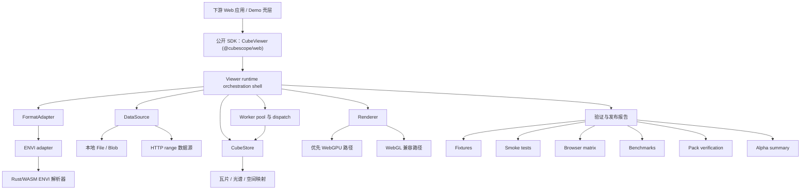
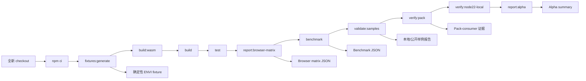
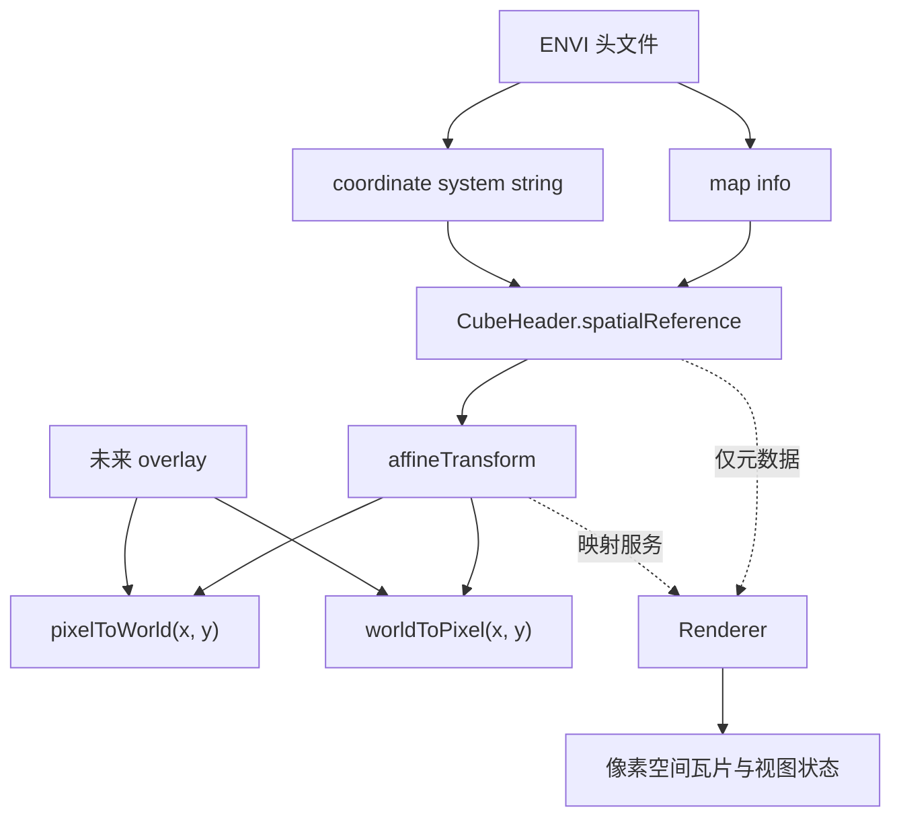

# CubeScope 软件论文草稿 v1（中文译稿）

本文档是 Track A 软件论文的第一版面向稿件的草稿中文译稿。其写法首先对齐
`SoftwareX` 风格，同时保留足够紧凑的核心叙事，以便后续在需要时压缩为更适合
`JOSS` 的投稿版本。

## 投稿定位

- 首选目标期刊：`SoftwareX`
- 备用路径：`JOSS`
- 论文类型：研究软件 / 科学软件论文
- 论文目标：将 `CubeScope` 建立为可引用、可复用的浏览器原生高光谱查看软件

## 建议的论断边界

论文应将 `CubeScope` 描述为：

- 一个浏览器原生、本地优先、硬件加速的 viewer kernel
- 当前聚焦于 ENVI 高光谱数据集
- 可嵌入到下游 Web 应用中
- 具备可复现的构建、测试、benchmark 与打包工作流支撑

论文不应将 `CubeScope` 描述为：

- 一个完整的遥感分析平台
- 一个通用 GIS 系统
- 一个完整的云原生地理空间技术栈
- 一个成熟完整的科学分析套件

这个边界之所以重要，是因为当前 alpha 版本最强的地方，在于它是一个工程质量较
高、且具备可复现软件发布实践的 viewer kernel。

## 备选标题

1. `CubeScope: a browser-native, local-first viewer kernel for ENVI hyperspectral datasets`
2. `CubeScope: reproducible browser-native viewing software for ENVI hyperspectral cubes`
3. `CubeScope: an embeddable Rust/WASM and WebGPU-enabled viewer for ENVI hyperspectral data`

建议：

- 第一版完整稿使用标题 `1`
- 如果投稿时需要更强调软件复用性与可复现性，而弱化实现细节，则使用标题 `2`

## 摘要草案

CubeScope 是一个面向 ENVI 高光谱数据集的浏览器原生 viewer kernel。该软件填补
了重型桌面或以服务端为中心的遥感环境，与轻量级 Web 图像查看器之间的空白，
通过现代浏览器中的本地优先、可嵌入式多波段影像立方交互，提供一种新的软件路
径。CubeScope 结合了 Rust/WebAssembly 的 ENVI 解析器、用于后台加载和面向瓦
片运行时工作的 Web Workers，以及一条优先选择 WebGPU 且保留经过验证的
WebGL 兼容回退路径的硬件加速渲染链。当前 alpha 版本支持本地 ENVI 加载、基
于 HTTP range 的远程 ENVI 访问、归一化的 cube 元数据、光谱探测、从 ENVI 空
间元数据推导出的像素到世界坐标仿射映射，以及 worker 与 WebAssembly 资产的
显式运行时打包。为支持复用与评估，仓库同时提供了确定性测试样例、公开样例验
证、benchmark 命令、浏览器 smoke 测试、打包校验，以及锚定于可复现 Node 22
工具链的发布闸门报告。CubeScope 被有意限定为一个可嵌入的 viewer kernel，而
不是完整分析平台，从而使下游 Web 应用能够在不引入重型后端栈的前提下集成高
光谱浏览能力。本文描述了该软件的架构、实现选择、可复现性策略以及当前 alpha
能力边界，并将 CubeScope 定位为后续多光谱、地理空间和分析扩展的基础。

## 可选短摘要版本

只有在期刊或投稿系统要求更短摘要时才使用本版本。

CubeScope 是一个面向 ENVI 高光谱数据集的浏览器原生、本地优先 viewer kernel。
它结合 Rust/WebAssembly 解析器、Web Workers，以及同时支持 WebGPU-first 与
WebGL 兼容路径的硬件加速渲染，在现代浏览器中提供可嵌入的 cube 浏览能力。当
前 alpha 版本支持本地与基于 HTTP range 的远程 ENVI 加载、归一化元数据、光谱
探测、像素到世界坐标的仿射映射，以及可复现的构建、测试、benchmark 和打包工
作流。CubeScope 被有意限定为 viewer kernel，而不是完整分析平台，从而为下游科
学 Web 应用，以及后续的多光谱、地理空间和分析能力扩展提供可复用基础。

## 贡献表述

论文应围绕以下三个主要贡献展开：

1. `CubeScope` 提供了一条浏览器原生的软件路径，用于 ENVI 高光谱浏览，而不需
   要依赖重型后端栈。
2. `CubeScope` 暴露出一种可复用的 viewer-kernel 架构，在数据访问、格式处理、
   运行时编排和渲染之间建立了明确边界。
3. `CubeScope` 将可复现性纳入软件贡献本身，通过提供 fixtures、验证工作流、
   打包校验、benchmark 命令和引用元数据，形成完整软件证据链。

### 1. 引言

高光谱遥感工作流至今仍主要由重型桌面应用、以 notebook 为中心的脚本环境，或
以服务端为中心的地理空间技术栈主导。这些生态当然仍然有价值，但当用户需要快
速可视检查、轻量分享、基于浏览器的审阅，或者集成到自定义科学 Web 界面中时，
它们往往会带来实际阻力。现实中，很多团队已经能够在 Python 或桌面软件中处理
高光谱数据，但仍然缺少一个可复用的浏览器侧查看器，能够嵌入到下游应用中，而
不必重建整个数据访问、元数据处理与渲染链路。

近年的浏览器能力让另一条软件路径变得可行。WebAssembly、Web Workers 与现代
GPU API 使浏览器运行时具备了远高于早期 Web 图像查看器的能力。然而，许多面向
浏览器的示例仍然只是薄薄一层演示，或高度耦合的应用代码，难以作为可复用的研
究软件。对于高光谱影像而言，这个空白并不只是“把像素画出来”这么简单。它还涉
及 ENVI 元数据解析、格式语义保真、面向光谱的交互支持，以及足够低的运行时延迟，
以支撑实际探索性使用。

CubeScope 被设计为一个 viewer kernel，而不是完整分析平台，以填补这一空白。项
目聚焦于问题中既具广泛复用性、又当前相对缺失的那一部分：浏览器原生、本地优先
的 ENVI 影像立方浏览能力，并配套显式运行时打包、硬件加速渲染以及小而可嵌入
的公开 API。这个范围是刻意收敛的。它让软件现在就能贡献一个具体、可复用的成
果，同时为后续的多光谱、地理空间和分析导向扩展保留空间，而不把这些问题强行
塞进第一个公开版本。

因此，本文的贡献是软件性的，而不是算法性的。本文将 CubeScope 作为一个浏览器
原生的 ENVI viewer kernel 来呈现，其架构将字节访问、格式适配、面向 cube 的读
服务、运行时编排与渲染明确分离。本文也将可复现性视为贡献的一部分，通过文档
化稳定运行时基线、确定性 fixtures、打包校验、浏览器 smoke 测试，以及一个小型
benchmark harness，来支撑软件主张。简言之，本文认为，在完整分析平台尚未形成
之前，一个可复用的高光谱查看核心本身就已经可以构成有意义的研究软件产出。

### 2. 软件概览与范围

#### 2.1 设计目标

CubeScope 由五个设计目标驱动：浏览器原生执行、本地优先使用、硬件加速交互、
可嵌入的 SDK 边界，以及可复现的发布实践。浏览器原生意味着软件应运行于标准现
代浏览器中，而不是依赖定制桌面壳或强制远程后端。本地优先意味着主要工作流不
应要求先经过服务端预处理或云部署才能查看数据。硬件加速意味着查看器应尽可能
利用现代浏览器的渲染路径，同时保留兼容性回退。可嵌入意味着软件应能够作为包
被集成进其他 Web 应用，而不只是一个独立 demo。可复现则意味着构建、测试、
benchmark、运行时打包以及引用元数据，都应被视为一等软件产出。

#### 2.2 当前支持的工作流

当前 alpha 版本是有意收敛的。稳定公开包为 `@cubescope/web`，其主要公开类为
`CubeViewer`。主要加载入口为 `load(source)`，其中 `source` 当前支持两条
ENVI-first 工作流：用于本地文件对的 `envi-local`，以及用于浏览器可见 `CORS`
与 `HTTP range` 支持下远程 ENVI 资产的 `envi-http`。在这一范围内，查看器已经
支持伪 RGB 渲染、波段切换、通过归一化 `CubeHeader` 暴露元数据、像素光谱探测，
以及在存在空间元数据时的源图像像素/世界坐标映射。

这个工作流足够实用，同时又足够诚实。CubeScope 并不试图给出一个超出实现能力
的 alpha 表面。该包公开了 worker 和 WebAssembly 资产的显式路径，说明了如何
在 bundler 环境中集成它们，并且仅将 `loadFile(...)` 和 `EnviViewer` 等兼容别名
作为 `0.x` 阶段的过渡便利保留。其意图是先稳定一个紧凑的浏览器 SDK，而不是过
早承诺一个过大的公开 API 面。

#### 2.3 本文的明确非目标

有若干能力被明确排除在本文和当前发布范围之外。CubeScope 还不是完整的遥感分
析平台；它并不试图提供庞大的算法库、工作流管理或可直接用于论文发表级产出的
科学导出层。它也不是一个通用 GIS 引擎，当前并不尝试在世界坐标空间中进行实时
重投影渲染。空间支持按设计被限制在元数据归一化和仿射像素/世界坐标映射层面。
同样，尽管架构上预留了向更多遥感格式扩展的能力，当前软件论文仍然保持 ENVI-first，
而不去宣称实现尚未真正具备的广泛格式覆盖能力。

这些非目标并不会削弱论文，反而强化了论文。它们帮助我们更清楚地定义软件贡献：
一个面向浏览器的、可复现、可嵌入的 ENVI 高光谱影像立方 viewer kernel。这本身
就已经是一项连贯且有用的科学软件成果，并为后续扩展提供了稳定基础。

### 3. 软件架构与实现

#### 3.1 高层架构

CubeScope 被组织成一个分层的浏览器软件栈。最外层是公开 SDK，它暴露一个紧凑
的、基于类的 API，以 `CubeViewer` 为中心。在其下方，是负责编排的 viewer runtime，
而不是拥有格式语义的实现层。运行时负责协调加载、事件发射、worker 活动、视图
更新与渲染器交互，但不会把所有职责都压进一个单体。再往下是数据访问与格式特定
服务，它们负责把原始源字节转换为归一化 cube 元数据和读操作。渲染层消费的是已
准备好的栅格与视图状态，而不是直接消费源格式细节。围绕这一切的，是发布与验证
层，包含 fixtures、smoke tests、browser-matrix 检查、打包校验、benchmark 命令
和 alpha 报告。

这个架构之所以重要，是因为 CubeScope 预期会被其他应用复用。一个把 demo 控件、
源解析、缓存状态、worker 消息和 GPU 逻辑全部揉进单一实现的 viewer kernel，
即使在内部原型阶段仍能工作，也很难作为研究软件获得信任。因此，CubeScope 将
边界纪律视为产品的一部分：解析不等于渲染，渲染不等于分析，demo UI 也不等于公
开 API。

#### 3.2 核心架构缝隙

核心缝隙包括 `DataSource`、`FormatAdapter`、`CubeStore`、`Renderer`，以及运行
时编排壳层。`DataSource` 仅负责字节访问。在当前 alpha 中，这包括本地 `File` 或
`Blob` 访问，以及一个基于 HTTP range 的远程路径。`FormatAdapter` 将面向字节的
源转换为面向 cube 的操作。在当前系统中，第一方 adapter 聚焦 ENVI，负责解析元
数据、理解存储布局，并支持瓦片与光谱提取。`CubeStore` 充当上层使用的读模型：
它暴露归一化元数据，提供瓦片与光谱请求服务，并在存在空间元数据时处理源图像空
间中的坐标映射。`Renderer` 接收已准备好的栅格层和视图状态，并且被刻意与格式
解析和源特定元数据归属相分离。

运行时壳层对这些组件进行协调，但不拥有它们全部的内部逻辑。项目早期，
`viewer-runtime` 曾积累过多内联状态和跨领域职责。当前 alpha 已经通过抽取
render-session 管理、工作调度、worker-pool 生命周期、dispatch policy、响应路由、
reaction planning、lifecycle handling、transition handling 和视图更新等独立内
部模块，显著降低了这种耦合。这个重构本身并不被当作学术创新来包装，但它对软
件质量非常重要，因为它使公开 SDK 保持稳定，同时允许内部继续演化。

#### 3.3 运行时实现

该实现以一种务实而非炫技的方式组合了几个浏览器时代的关键技术。ENVI 元数据解
析锚定在 Rust/WebAssembly 组件上，它为当前格式支持提供权威解析层。那些不应阻
塞主线程的运行时工作被转发到 Web Workers 中，包括加载相关任务以及面向瓦片的
viewer 工作。这里使用了显式消息信封和 source-aware 请求跟踪，以防止过期结果
污染当前激活的 source 状态。大块二进制传输遵循适合浏览器的所有权规则，而不是
默认结构化克隆成本可以忽略不计。

渲染是硬件加速的，并且优先选择 WebGPU，但当前 alpha 并不假装 WebGPU 在所有
环境下都可用。因此，CubeScope 保留了 WebGL 兼容渲染器，并将回退路径视为真
实产品链路的一部分，而不是理论上的备用方案。在 `auto` 模式下，当前 viewer 会话
优先使用 WebGPU；但如果发生 device-loss 事件，恢复可以转入 WebGL。实现层还
考虑到了一个真实浏览器约束：某些浏览器在从失效的 WebGPU 状态跨到 WebGL 时，
需要一个新的绘图上下文，因此恢复路径会在继续之前重建 render canvas。这样一来，
兼容性故事就是可验证的，而不是停留在愿景上。

#### 3.4 空间元数据切片

当前 alpha 中的空间支持遵循一种刻意保守的边界。ENVI 中的 `map info` 和
`coordinate system string` 等字段会被解析并归一化为稳定的
`CubeHeader.spatialReference` 对象。在可能的情况下，软件会进一步推导出仿射变换，
并通过公开 viewer 合约暴露 `pixelToWorld()` 和 `worldToPixel()`。这已经足以支
撑坐标感知式检查，并为后续 overlay 导向工作做好准备。

同样重要的是，CubeScope 在这里没有做什么。渲染器仍然工作在像素空间。软件尚不
尝试完整坐标参考系统转换、实时重投影或世界空间栅格扭曲。这个决策保留了渲染
的简洁性，也让当前成熟度下的地理空间叙事保持诚实。对于软件论文来说，这是正
确的取舍：项目已经展示了有意义的空间元数据支持，而没有夸大其当前范围。

### 4. 可复现性、打包与质量保证

#### 4.1 发布与运行时策略

CubeScope 将发布工程视为软件贡献的一部分，而不是事后补上的项目卫生工作。当
前 alpha 作为一个单独的公开浏览器 SDK 包 `@cubescope/web` 发布，并显式暴露
worker bundle 和 WebAssembly 解析运行时所需的资产。这对复用很重要。许多面向
浏览器的科学软件包在下游集成失败，并不是因为其核心逻辑不可用，而是因为 worker
和运行时资产被隐藏在仓库特有的假设中。为此，CubeScope 将这些资产文档化为支
持包表面的一部分。

项目还采用了明确的运行时支持策略。Node `22.x` 是发布闸门和可复现性主张的官
方基线，尽管更新版本的 Node 仍可以用于日常本地开发。这个策略使软件对齐于长
期支持运行时，并在论文或 release note 中描述已验证的构建和验证行为时减少歧义。
在当前本地验证环境中，已验证运行时为 Node `v22.22.2` 和 npm `10.9.7`，配套
Rust 工具链包含 `wasm32-unknown-unknown` target 以及 `wasm-bindgen-cli 0.2.100`。

#### 4.2 验证工作流

可复现性工作流被刻意设计为命令驱动且仓库可见。一条全新本地验证路径从依赖安
装和确定性 fixture 生成开始，接着经过 Rust/WASM 重建、浏览器 SDK 构建输出、
contract tests、浏览器 smoke tests、benchmark 收集、remote-sample 验证、
package-consumer 校验，以及 alpha summary 生成。项目没有将这些步骤散落在零碎
说明中，而是通过显式命令和机器可读输出来记录它们。

这个验证模型产生了一系列同时服务于开发和发表的工件。Benchmark 输出写入
`output/benchmark/latest.json`；本地 browser-matrix 报告写入
`output/browser-matrix/latest.json`；remote-sample 检查记录在 `output/samples/`
下；来自隔离 consumer 应用的打包验证记录在 `output/pack-consumer/latest.json`；
而综合 alpha 状态快照写入 `output/alpha/local-alpha-summary.json`。这些输出来共同
支撑项目主张：不仅软件可以被构建，而且其支持的运行时、打包表面和浏览器行为已
经以可复现方式被检查。

这个工作流还有一个有价值的性质：它同时验证了可嵌入性。隔离 consumer 检查确认
打包后的 tarball 暴露出预期的公开表面，并包含下游应用所需的运行时资产。在当前
alpha 快照中，这些已验证资产包括 ES module 构建、worker bundle、WebAssembly
解析器文件、用于验证的 fixture 载荷、remote-sample catalog 以及引用元数据。这
对软件论文尤其重要，因为它把“可复用”从一个愿望，变成了至少已经在源树之外被
实际演练过的事实。

#### 4.3 公开样例与合法可复现性

当前 CubeScope 使用双样例可复现性策略。首先，仓库提供一个从源生成的确定性合
成 ENVI fixture，并将其用于 smoke tests、浏览器自动化以及早期 benchmark 收集。
这个 fixture 刻意保持小而可控；其目标是支持可重复验证，而不是提供广泛科学代表
性。其次，仓库现在还提供一个已验证的公开远程 ENVI 样例 `snowex-aviris-ng-sasp`，
它通过同样的浏览器侧工作流被演练，并记录在公开样例验证报告中。

这两类样例的区分是有意义的。合成 fixture 为项目提供了一个不会受外部托管变化影
响的确定性基线。而公开样例则帮助证明远程读取路径不只是本地演示。为了让这套公
开样例叙事保持诚实，CubeScope 为候选远程样例提供了一套资格审查与晋级工作流，
而不是把任何一个可访问 ENVI 文件都当成可发表证据。这套工作流会检查 header 可
达性、`HTTP range` 支持等传输行为，同时验证样例在 demo 路径中是否仍然可被浏
览器正常使用。

### 5. 示例性使用场景

最简单的 CubeScope 工作流是本地浏览器加载一个 ENVI header 及其配对数据文件。
在这种模式下，下游应用创建一个 `CubeViewer`，完成初始化，然后用两个文件对象调
用 `load({ kind: 'envi-local', ... })`。这一工作流被刻意保持直接，因为项目目标之
一就是让基于浏览器的检查变得实际可行，而不需要先经过后端上传或数据集转换步骤。
数据加载完成后，viewer 可以暴露归一化元数据、渲染伪 RGB 视图、支持波段切换，
并为像素检查返回光谱曲线。

第二条使用路径是通过 `HTTP range` 访问远程 ENVI 数据。在这里，viewer 合约保持
不变，但 source 由 `headerUrl` 和 `dataUrl` 而不是本地文件句柄来描述。这一路径
要求服务端具备浏览器可见的 `CORS` 与 `HTTP range` 支持，但允许 Web 应用在视图
开始前不必预先下载整个数据对象，就能与 ENVI 数据交互。本地与远程两种模式共用
同一个 viewer 合约，这一点对软件复用很重要，因为它减少了下游应用分支逻辑的复
杂度。

第三种场景是 SDK 嵌入。CubeScope 并不只是一页交互 demo；它同样被打包成一个可
被其他 Web 应用导入的包，能够挂载到宿主应用自己的 DOM 结构中，并在 bundler
重写静态资源路径时，显式提供 worker 和 WebAssembly 资产 URL。这个嵌入故事，
是将 CubeScope 描述为 viewer kernel 而非独立应用的最重要理由之一。研究团队或
产品团队可以把 viewer 集成到已有浏览器界面中，而不必采用仓库中的 demo 壳层，
也不必从零重建底层加载与渲染链路。

### 6. 早期评估

#### 6.1 评估设置

当前评估应被理解为一次软件发布级检查，而不是完整系统 benchmark 活动。目标是
说明浏览器运行时路径在实践中是可行且可复现的，而不是现在就宣称在桌面或服务端
替代方案面前拥有全面性能优势。当前 benchmark 报告生成于一个 macOS（`darwin`）
环境，使用 Node `v22.22.2`、Chromium `147.0.7727.15`，以及仓库中的确定性 ENVI
fixture。该 fixture 维度为 `48 x 48 x 32`，采用 `bsq` 交错方式，并在两个场景中被
使用：一个是本地 blob-backed 路径，另一个是通过 sample catalog 暴露的同源
`http-range` 路径。

当前 benchmark 命令会固定使用 WebGL 兼容渲染路径，以保持面向软件论文的验证结
果具有确定性。与此同时，browser-matrix 报告则同时演练了一个强制 `webgl` 场景，
和一个从 WebGPU 开始、在 device-loss 后验证恢复到 WebGL 的 `auto` 场景。这种
分离是有益的，因为它避免把发布可复现性目标与渲染器恢复链探索混杂在一起，同时
又对两者都进行了记录。

#### 6.2 报告指标

当前 benchmark harness 记录三个早期指标：header parse time、time to initial view
和 band-switch time。在本地文件场景下，测得值大约分别为 `12.5 ms`、`23.2 ms`
和 `7.6 ms`。在使用 `HTTP range` 的同源远程场景下，测得值大约分别为 `10.4 ms`、
`36.7 ms` 和 `31.1 ms`。

这些数值被有意作为仓库当前验证输出中的直接测量结果来报告，而不是被打磨后的比
较型 benchmark。它们足以说明当前 alpha viewer 已经能够在浏览器环境下支持交互
式加载和波段切换，并且远程读取路径在承担额外传输成本时仍然保持可用。

Browser-matrix 报告提供了另一类证据。在当前本地 Chromium 验证中，有两个场景
通过：一个强制 `webgl` 场景，以及一个 `auto` 场景。在 `auto` 场景下，记录到的
renderer status 表明会话在发生 device-loss 事件后，从 `webgpu` 过渡到 `webgl`，
并以恢复状态完成。这本身还不能证明在所有浏览器和硬件上的广泛鲁棒性，但它至少
说明兼容路径不是通过静态代码检查来“假定存在”，而是通过一条实际浏览器工作流被
验证。

#### 6.3 结果解释

这些结果应被保守解释。它们是来自确定性验证环境中的早期软件发布级指标，而不是
后续 systems/performance 论文的最终证据基础。它们尚未将 CubeScope 与纯
JavaScript 基线、服务端预处理工作流，或更宽的浏览器与硬件矩阵进行比较。这些
比较应属于下一研究轨道，在方法论更加稳定之后再展开。

即便如此，这组当前评估对软件论文仍然已经有意义。它表明浏览器原生高光谱交互
并不只是愿景，远程读取路径已经可运行，渲染器兼容性故事是可测试的，而且项目的
性能主张是绑定在仓库可见 benchmark 命令上的，而不是叙事性断言。对于一篇第一
阶段的软件导向论文而言，这种“可测交互行为 + 可复现验证”的组合，比过早追求更
大的系统性能论证更重要。

### 7. 影响、复用潜力与局限性

CubeScope 最直接的影响，是降低了基于浏览器进行高光谱查看的门槛。用户或下游
团队不必为了在浏览器中加载 ENVI cube、检查元数据、探测光谱或切换波段，就采
用一个重型远程后端或完整桌面分析环境。这一点无论对于探索性科学工作，还是对于
构建审阅、标注、质量控制或教学界面来说，都具有实际意义。

第二类影响来自复用。CubeScope 被刻意定义为 viewer kernel，而不是一个单体应用。
这使它不仅对最终用户有用，也对那些需要在更大系统中嵌入浏览器侧 ENVI viewer
的开发者有用。包级公开 API、显式运行时资产，以及 pack-consumer 验证，使得这一
复用故事比“只展示自身内部 demo 页”的仓库更有说服力。从这个意义上说，
CubeScope 贡献的是面向科学 Web 应用的软件基础设施，而不只是一个独立 viewer。

当前版本还为后续扩展创造了实际基础。由于架构已经区分了字节访问、格式适配、
面向 cube 的读服务、运行时编排与渲染，后续在多光谱支持、更丰富的空间 overlay、
额外 source format 或分析插件方面的工作，都可以建立在一个相对稳定的核心之上。
这种未来价值固然重要，但并不是当前版本有意义的唯一理由。当前 alpha 作为可复
用研究软件，本身就已经具有独立价值。

不过，也有若干局限必须明确陈述。首先，软件当前仍然是 ENVI-first，而不是一个
广泛多格式系统。其次，主要工件是浏览器 SDK，因此那些完全工作在 Python 或桌面
环境中的用户仍然需要一个集成层。第三，远程 `envi-http` 工作流依赖于托管端点具
备浏览器兼容的 `CORS` 与 `HTTP range` 行为。第四，当前 benchmark 范围被有意
保持狭窄，不应被误解为完整比较型系统研究。最后，当前 alpha 只包含有限的分析导
向交互，还不是一个完整科学分析环境。

### 8. 结论

CubeScope 证明了：在不等待完整遥感分析平台成型的前提下，浏览器原生高光谱查
看能力已经可以被打包成严肃的研究软件。当前 alpha 版本建立了一个可复现、可嵌
入的 ENVI viewer kernel，其基础由 Rust/WebAssembly 解析器、面向 worker 的运行
时执行，以及带有已验证兼容回退路径的硬件加速浏览器渲染共同构成。同样重要的是，
它将这些运行时能力与确定性 fixtures、公开样例验证、打包校验、benchmark 命令
和发布闸门报告配套结合起来，从而提高软件的可检查性、可复用性与可引用性。

因此，本文的贡献具有双重性质：一方面，它提供了一条面向 ENVI 高光谱交互的可
用浏览器软件路径；另一方面，它表明可复现性与发布纪律可以被视为科学软件贡献
的一等组成部分。在当前范围内，CubeScope 已经为那些需要高光谱查看能力、但不
希望引入重型后端栈的下游 Web 应用提供了有意义的软件基础。

近一步工作应优先扩展能力宽度，而不是继续推高复杂度。最自然的下一步包括更广
的多光谱支持、更丰富的像素空间空间 overlay，以及像 GeoTIFF、COG 或 Zarr 这
样经过谨慎分阶段引入的新数据源 adapter，之后再进入轻量分析扩展和更深入的系统
级评估。从这个意义上说，当前版本既是一个可直接使用的软件工件，也是下一研究
轨道的稳定基础。

## 图 1 草案：系统架构总览

建议图注：

`图 1。CubeScope 的高层架构。公开浏览器 SDK 暴露一个可嵌入 viewer 表面；运行
时壳层负责协调数据访问、格式适配、面向 cube 的读取、worker 执行与硬件加速渲
染。可复现性与发布验证则作为软件贡献的一部分环绕整个运行时。`

## 表 1 草案：可复现性证据表

建议表注：

`表 1。当前 alpha 版本中，仓库可见的验证命令及其产生的证据。`

| 验证步骤 | 命令 | 主要产物 | 用途 |
| --- | --- | --- | --- |
| 构建可复现性 | `npm run build` | `dist/cubescope.es.js`、`dist/worker.js`、`dist/pkg/*` | 从源码重建浏览器 SDK、worker bundle 与运行时资产 |
| Contract 与 smoke 检查 | `npm run test` | 本地测试输出 | 验证公开合约行为与浏览器 smoke 路径 |
| 浏览器兼容性证据 | `npm run report:browser-matrix` | `output/browser-matrix/latest.json` | 记录 Chromium 下 `webgl` 与 `auto` 渲染场景行为 |
| 早期性能证据 | `npm run benchmark` | `output/benchmark/latest.json` | 采集软件论文所需早期交互指标 |
| 本地 remote-sample 验证 | `npm run validate:samples` | `output/samples/latest.json` | 验证确定性本地 `envi-http` 样例目录 |
| 公开 remote-sample 验证 | `CUBESCOPE_SAMPLE_TIER=public CUBESCOPE_SAMPLE_REPORT_PATH=output/samples/public-latest.json npm run validate:samples` | `output/samples/public-latest.json` | 复现已发布公开远程 ENVI 样例路径 |
| 打包与嵌入证据 | `npm run verify:pack` | `output/pack-consumer/latest.json` | 确认 tarball 安装/导入与打包资产在隔离 consumer 应用中可用 |
| 目标运行时验证 | `npm run verify:node22-local` | `output/toolchain/node22-local-verification.json` | 在官方 Node `22.x` 基线上重跑 alpha 闸门 |
| 综合发布快照 | `npm run report:alpha` | `output/alpha/local-alpha-summary.json` | 汇总发布闸门状态与支撑产物 |

## 表 2 草案：早期 Benchmark 表

建议表注：

`表 2。当前本地验证环境中，从确定性 benchmark fixture 采集到的早期交互指标。
这些数字被作为软件发布级证据报告，而不是最终比较型系统结果。`

| 场景 | Source 类型 | Fixture 尺寸 | Header parse time (ms) | Time to initial view (ms) | Band switch time (ms) |
| --- | --- | --- | ---: | ---: | ---: |
| 本地 fixture | `blob` | `48 x 48 x 32` | `12.5` | `23.2` | `7.6` |
| 同源远程 fixture | `http-range` | `48 x 48 x 32` | `10.4` | `36.7` | `31.1` |

## 图 2 草案：可复现性工作流

建议图注：

`图 2。当前 alpha 版本使用的可复现性与发布验证工作流。确定性 fixtures、运行
时重建、浏览器验证、benchmark 收集、打包校验和 alpha 报告，都被视为仓库可见
的软件产出。`

## 图 3 草案：空间元数据与像素/世界坐标映射

建议图注：

`图 3。CubeScope 当前的空间参考边界。ENVI 空间字段被归一化为元数据与仿射映
射，而渲染仍然保持在像素空间。`

## 表 3 草案：功能与范围表

建议表注：

`表 3。面向软件论文的当前 alpha 能力边界。`

| 能力领域 | 当前 alpha 状态 | 论文中的说明 |
| --- | --- | --- |
| 本地 ENVI 加载 | Supported | 通过 `envi-local` 实现的主要零安装工作流 |
| 远程 ENVI 加载 | Supported | 需要浏览器可见 `CORS` 与 `HTTP range` |
| 伪 RGB 渲染 | Supported | 核心 viewer 交互路径 |
| 波段切换 | Supported | 已纳入 benchmark 与 smoke 验证 |
| 光谱探测 | Supported | 已通过公开 viewer 表面提供 |
| 归一化 cube 元数据 | Supported | 通过 `CubeHeader` 暴露 |
| ENVI 空间元数据归一化 | Supported | 包括 `map info`、`coordinate system string` 与仿射映射 |
| 像素/世界坐标映射 | Supported | 通过 `pixelToWorld()` 与 `worldToPixel()` 提供 |
| WebGPU-first 渲染 | Supported | 在 `auto` 模式中优先使用 |
| WebGL 兼容渲染 | Supported | 已验证回退与恢复路径 |
| 打包 SDK 嵌入 | Supported | 已通过隔离 consumer 安装/导入验证 |
| ENVI 之外的多格式支持 | Deferred | 超出当前软件论文范围 |
| 实时重投影渲染 | Deferred | 当前 alpha 的明确非目标 |
| Python/Jupyter bridge | Deferred | 计划在后续 adoption-oriented 阶段推进 |
| 广泛分析插件套件 | Deferred | 超出当前 viewer-kernel 发布范围 |

## 表 4 草案：架构职责表

建议表注：

`表 4。CubeScope 主要架构缝隙的职责边界。`

| 层 / 缝隙 | 主要职责 | 明确不属于其职责的内容 |
| --- | --- | --- |
| `DataSource` | 面向本地或远程 source 数据的字节访问 | 格式解析、渲染、viewer 策略 |
| `FormatAdapter` | 解释格式语义、解析元数据、支持瓦片/光谱提取 | GPU 渲染、demo 逻辑、公开 UI 策略 |
| `CubeStore` | 暴露归一化元数据与面向 cube 的读服务 | 直接解析源字节、拥有渲染器资源 |
| Runtime shell | 协调加载、workers、视图更新与事件流 | 充当格式特定解析器或渲染器实现 |
| `Renderer` | 绘制已准备好的栅格数据并管理渲染资源 | 解析源字节、归一化源元数据、选择数据集语义 |
| Reproducibility layer | 记录验证证据与发布闸门状态 | 替代运行时功能或科学分析逻辑 |

## 其他计划中的图表

以下项目仍然建议纳入最终投稿包：

1. 公开 API 与运行时资产布局图
2. 将当前草案图表转换为更适合投稿排版的正式版本
3. 本地与远程使用场景的可选截图图

## 已有证据

当前草稿已经可以调用以下仓库工件作为证据：

- 架构与公开合约
  - `docs/ARCHITECTURE.md`
  - `docs/API.md`
- 发布与可复现性策略
  - `docs/REPRODUCIBILITY.md`
  - `docs/ALPHA_RELEASE_CHECKLIST.md`
  - `docs/RUNTIME_SUPPORT_POLICY.md`
- 阶段与发表策略
  - `docs/ROADMAP.md`
  - `docs/CUBESCOPE_BLUEPRINT.md`
- 阶段快照
  - `docs/STAGE_REPORT_2026-04-23.md`
- Benchmark 输出
  - `output/benchmark/latest.json`
- Browser matrix 输出
  - `output/browser-matrix/latest.json`
- Alpha 发布汇总
  - `output/alpha/local-alpha-summary.json`

## 投稿前仍需补齐的内容

这些事项不阻塞起草，但会阻塞最终打磨后的投稿：

1. 最终版架构图
2. 最终 benchmark 表排版
3. 一个干净的公开 release tag 与归档后的 release 元数据
4. 在仓库准备公开该闸门后补上的外部 CI 证据
5. 最终作者、单位与 funding 信息
6. 按目标期刊精确格式撰写的软件可得性声明

## 下一版写作说明

在将本文继续扩展为更正式稿件时，应遵循以下原则：

1. 保持软件论文语气，而不是营销语气
2. 优先使用可测量主张，而不是宽泛优越性主张
3. 诚实描述当前 alpha 边界
4. 将更深的性能比较论证留给后续 systems paper
5. 始终让论文锚定在复用性、架构与可复现性之上
